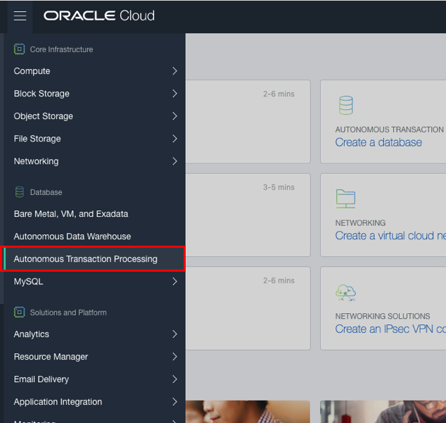
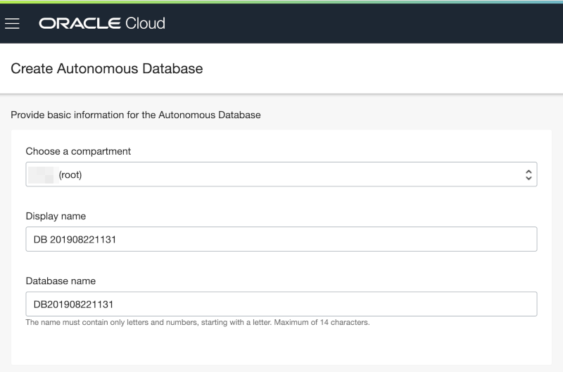
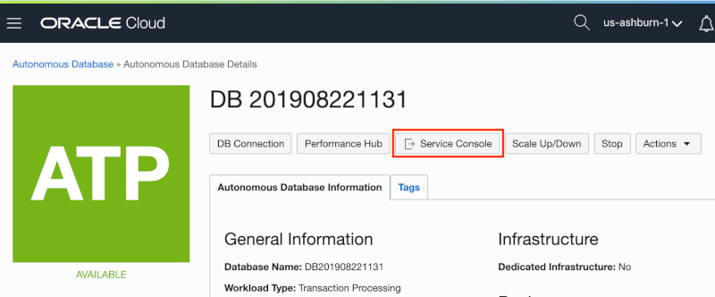
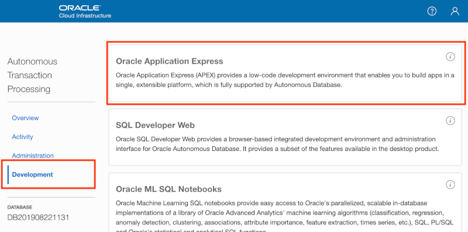

# Module 1: Create an APEX Workspace

## Introduction

Oracle Application Express (APEX) is a feature of Oracle Database, including the Autonomous Data Warehouse (ADW) and Autonomous Transaction Processing (ATP) services. To start, you will need to create an ATP instance and then access APEX from within the instance's Service Console. 

***To log issues***, click here to go to the [github oracle](https://github.com/oracle/learning-library/issues/new) repository issue submission form.

## Module 1 Objectives

- Log in to your Oracle Cloud account
- Create an Autonomous Transaction Processing instance
- Create a new workspace in APEX
- Log in to your new workspace

## Parts

### **Part 1:** Log in to your Oracle Cloud account

In this part, you will log into your Oracle Cloud account so that you can start working with various services.

1. You should have signed up for your Oracle Cloud trial account. If not, return to the Workshop Introduction and complete Part 1.

2. Once you receive the **Get Started Now with Oracle Cloud** email, make note of your **Username**, **Password**, and **Cloud Account Name**.

3. From any browser go to [https://cloud.oracle.com/en_US/sign-in](https://cloud.oracle.com/en_US/sign-in).

4. Enter your **Cloud Account Name** in the input field and click the **Next** button.

   

5. Enter your **Username** and **Password** in the input fields and click **Sign In**.

   

### **Part 2:** Create an Autonomous Transaction Processing instance

In this part, you will create an instance of the Autonomous Transaction Processing database service.

1. From the Cloud Dashboard, select the navigation menu icon in the upper left-hand corner and then select **Autonomous Transaction Processing**.

   

2. Click **Create Autonomous Database**.

   

3. Leave all of the default selections, enter **`SuperSecretPassw0rd`** for the ADMIN password, then click **Create Autonomous Database**.

   
   
   

   After clicking **Create Autonomous Database**, you will be redirected to the Autonomous Database Details page for the new instance. Continue to the next part when the status changes from PROVISIONING... to AVAILABLE.

### **Part 3:** Create a new workspace in APEX

When you first access APEX you will need to log in as an APEX instance administrator to create a workspace. A workspace is a logical domain where you define APEX applications. Each workspace is associated with one or more database schemas (database users) which are used to store the database objects, such as tables, views, packages, and more. These database objects are generally what APEX applications are built on top of.

1. Click the **Service Console** button.

   

2. Click **Development** option in the menu on the left, then click the **Oracle Application Express** option.

   

3. Enter the password for the Administration Services and click **Sign In to Administration**. The password is the same as the one entered for the ADMIN user when creating the ATP instance: **`SuperSecretPassw0rd`**

   

4. Click **Create Workspace**.
  
  

5. Enter the following details and click **Create Workspace**:

   | Property | Value |
   | -      | -         |
   | Database User | **DEMO** |
   | Password | **`SuperSecretPassw0rd`** |
   | Workspace Name | **DEMO** |
  
   

6. Click the **DEMO** link in the success message. This will log you out of APEX administration so that you can log into your new workspace. 
	
   

7. Enter **`SuperSecretPassw0rd`** for the password, check the **Remember workspace and username** checkbox, and then click **Sign In**.

   
