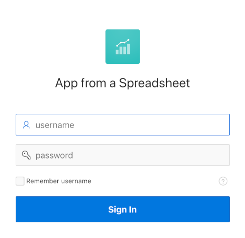

# Module 2: Create an App from a Spreadsheet

## Introduction

Now that you are logged into your workspace, you can start creating APEX applications. In this module, you will build a simple application based on a spreadsheet. Keep in mind that APEX is great for a variety of apps, from simple ones like this to large, sophisticated apps based on local database objects, REST enabled SQL objects, and even REST APIs.

While APEX developers spend the majority of their time in the App Builder, you should also investigate the SQL Workshop, where you can create and maintain database objects, Team Development, where you can track large APEX development projects, and the App Gallery, which contains numerous productivity and sample apps that can be installed within minutes.

***To log issues***, click here to go to the [github oracle](https://github.com/oracle/learning-library/issues/new) repository issue submission form.

## Module 2 Objectives

- Load project and tasks data
- Create and run an application

## Parts

### **Part 1:** Load project and tasks data

1. Click **App Builder** tab at the top, then click **Create a New App**. Note that you can just click **Create** if you already have an app defined.

   

2. Click **From a File**.

   

   When creating an application from a file, APEX allows you to upload CSV, XLSX, XML, or JSON files and then build apps based on their data. Alternatively, you can also copy and paste CSV data or load sample data. 

3. Within the Load Data wizard, click the **Copy and Paste** option at the top. Select **Project and Tasks** from the sample data set list and then click **Next**.

   

4. Review the parsed data. Set Table Name to **SPREADSHEET** and click **Load Data**. Note that the Error Table Name based on the Table Name with a postfix of \_ERR$.

   

   After clicking **Load Data** you will see a spinner until the wizard finished loading. Continue to Part 2 at that point.

### **Part 2:** Create and run an application

The Data Load wizard has created a new table and populated that table with the records from the sample data. Now you can create an app based on this new table.

1. Click **Continue to Create Application Wizard**.

   

2. Set Name to **App from a Spreadsheet**, click **Check All** for Features, and then click **Create Application**.

   
  
   

   When the wizard finishes creating the application, you will be redirected to the application's home page in the App Builder.

3. Click **Run Application** to see how end users will view the app at runtime.

   

4. Set username to **DEMO** and password to **`SecretPassw0rd`**, then click **Sign In**. 

   

5. Explore the application a little. Click **Spreadsheet** (in the home menu or the navigation menu) to view the sample data, then click the edit icon for a record to display the form page. Next, navigate to the **Dashboard** page and review the charts displayed there. Finally, review the options available under **Administration**.

   

## Summary

This completes Module 2. You now know how to create applications on top of data imported from other sources, such as spreadsheets. [Click here](?page=3-build-database-objects-in-autonomous-database.md) to navigate to Module 3.