# Module 3: Build Database Objects in Autonomous Database

## Introduction

Memorizing the SQL to create and maintain database objects can be difficult. However, there are tools that can generate the code for you based on a shorthand syntax or a graphical user interface. In this module, you will create database objects using Quick SQL and then view the objects in SQL Developer Web. Then you will then use SQL Developer Web to create an additional table and view all the database objects as a data model.

***To log issues***, click here to go to the [github oracle](https://github.com/oracle/learning-library/issues/new) repository issue submission form.

## Module 3 Objectives

- Create database objects using Quick SQL
- View database objects in SQL Developer Web
- View database objects as a data model
- Create a new table and add it to the data model

## Parts

### **Part 1:** Create database objects using Quick SQL

1. Return to your APEX Workspace and click the down arrow in the **SQL Workshop** tab, then select **SQL Scripts**.

   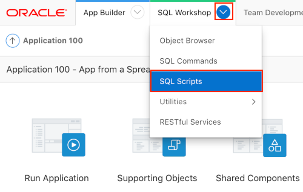

2. Click **Quick SQL**. Quick SQL is a tool for creating database objects and data using a SQL shorthand syntax.

   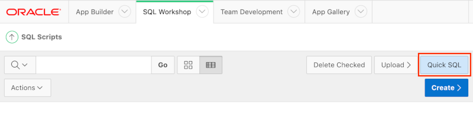

3. Copy the following SQL shorthand code and paste it into the left pane in Quick SQL.

    ```
    team_members /insert 10
      username /nn /upper
      full name
      email /nn
      phone_number
      profile
      photo file
    projects /insert 20
      name /nn
      project_lead /nn /references team_members
      budget num
      status vc30 /nn /check ASSIGNED, IN-PROGRESS, COMPLETED
      completed_date
      description
      milestones /insert 30
        name /nn
        due_date /nn
        description
      tasks /insert 100
        name /nn
        assignee /nn /references team_members
        milestone_id /references milestones
        start_date /nn
        end_date
        cost num
        description
        is_complete_yn /check Y, N
    view project_tasks projects tasks
    ```

4. Review the shorthand code. How many tables will be created and how are they related? What types of columns and constraints will be created for the tables? Note that the **Help** button provides details on the shorthand syntax along with several examples of its usage. Click **Generate SQL** when ready. 

   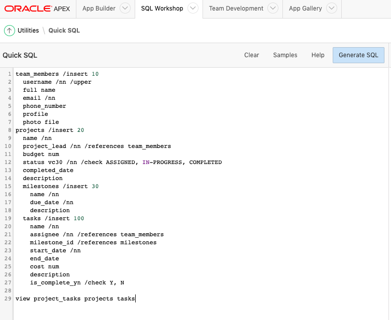

5. Review the SQL that is generated by default in the right-hand pane, then click **Settings** to make some changes to the resulting code.

   

6. Change the following settings and click **Save Changes**.

   | Property | Value |
   | --- | --- |
   | Object Prefix | **HOL** |
   | On Delete | **Restrict** |
   | Primary Keys | **12c Identity Data Types** |
   | Date Data Type | **TIMESTAMP WITH LOCAL TIME ZONE** |
   | Include | Select **Audit Columns** & **Row Version Number** |

   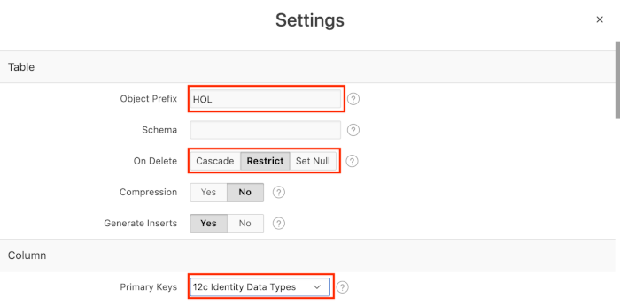

   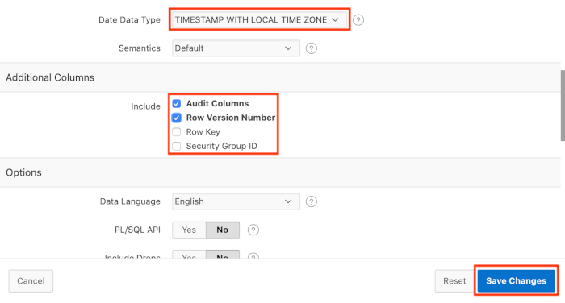

   After clicking **Save Changes** the SQL will be regenerated taking the new settings into account.

7. Click **Save SQL Script**.

   

8. Enter **HOL** for Script Name and click **Save Script**.

   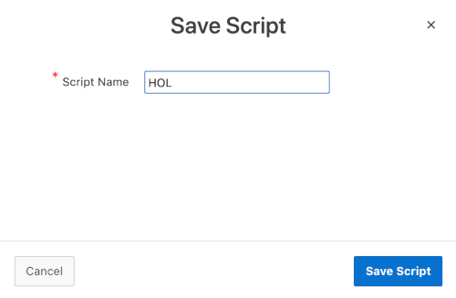

9. Click **Review and Run**.

   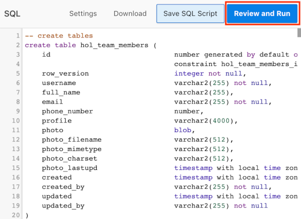

10. Click **Run**.

    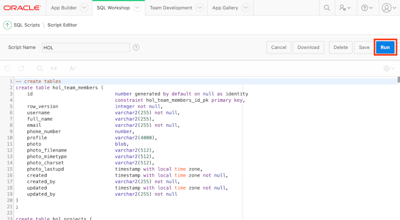

11. Click **Run Now**.

    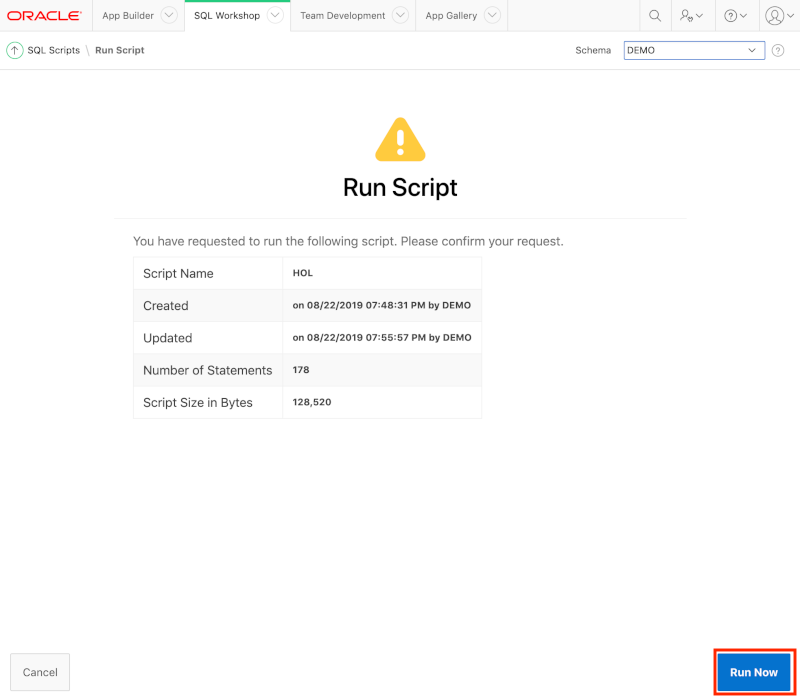

12. The Results page shows the results of running the script. Scroll to the bottom to see a summary. You should not see any errors.

    

13. To view the database objects that were created, click the arrow in the **SQL Workshop** tab and then select **Object Browser**.

    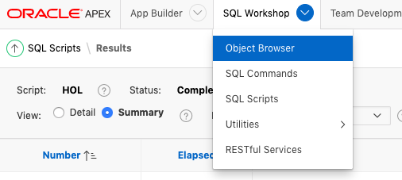

14. Select the **HOL_PROJECTS** table and review its columns.

    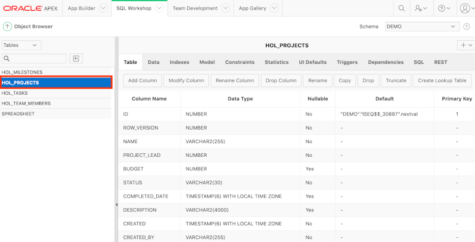

15. Click the **Data** tab to see the data that was loaded.

    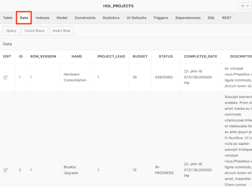

### **Part 2:** View database objects in SQL Developer Web

In this part, you will learn how to access SQL Developer Web and then use it to review the current database objects and make some modifications to the data model.

1. Switch to the ATP instance Service Console in your browser. Click the **Development** option in the menu on the left, then select **SQL Developer Web**.

   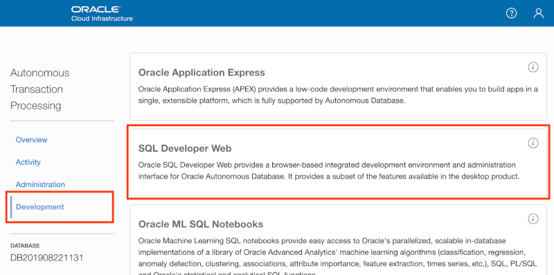

2. Set Username to **admin** and Password to **`SecretPassw0rd`**, then click **Sign In**.

   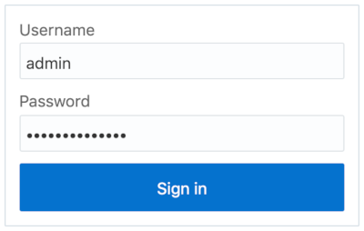

3. You created your database objects in the DEMO schema so you will need to enable SQL Developer Web access for that schema. Close the help popup, then copy and paste the following code into the  Worksheet:

    ```sql
    begin    
      ords_admin.enable_schema(
        p_enabled => true,
        p_schema => 'DEMO', -- Actual name of the schema
        p_url_mapping_type => 'BASE_PATH',
        p_url_mapping_pattern => 'demo', -- Alias used in the URL for access
        p_auto_rest_auth => true
      );

      commit;
      
    end;
    ```

4. Click the "Run Script" button to execute the code in the Worksheet. When the script finishes executing, you should see a success message under the Script Output tab at the bottom.

   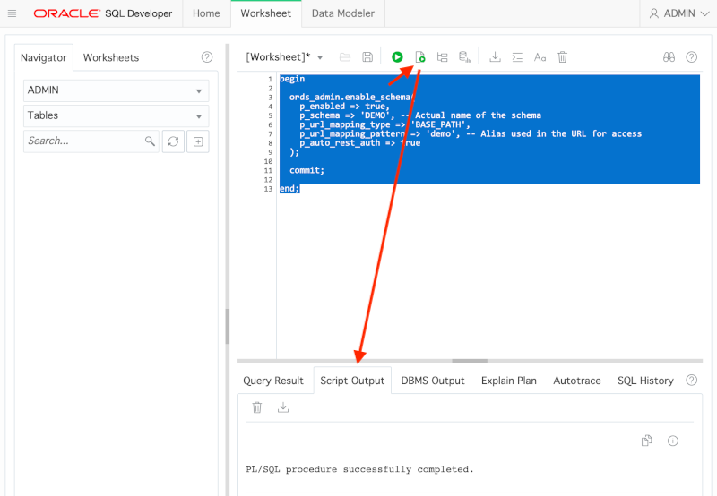

5. Change the URL by replacing **admin** with **demo** (the value passed to the p_url_mapping_pattern parameter in the script above). Then press enter to go to the new URL.

   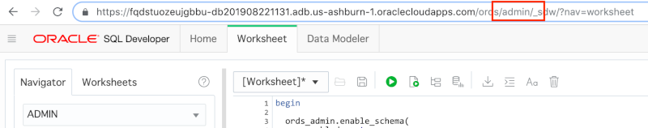

6. Set Username to **demo** and Password to **`SecretPassw0rd`**, then click **Sign In**.

   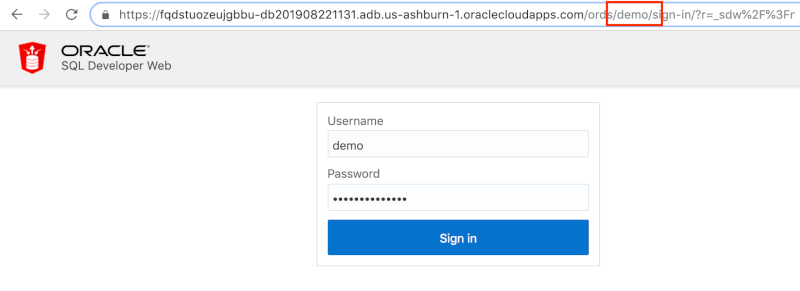

7. The Worksheet tab is displayed by default. Close the help popup and look under the **Navigator** tab to see the tables you created previously.

   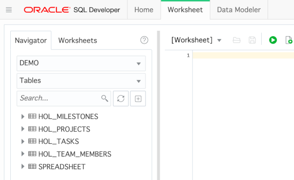

8. Expand the **HOL_PROJECTS** table to see the columns.

   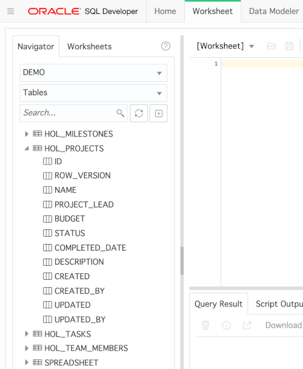

9. Enter the following SQL query in the Worksheet and click the "Run Statement" icon to see the data in the table.

    ```sql
    select * from hol_projects;
    ``` 
   
   The data should be displayed in the Query Result tab at the bottom. 
   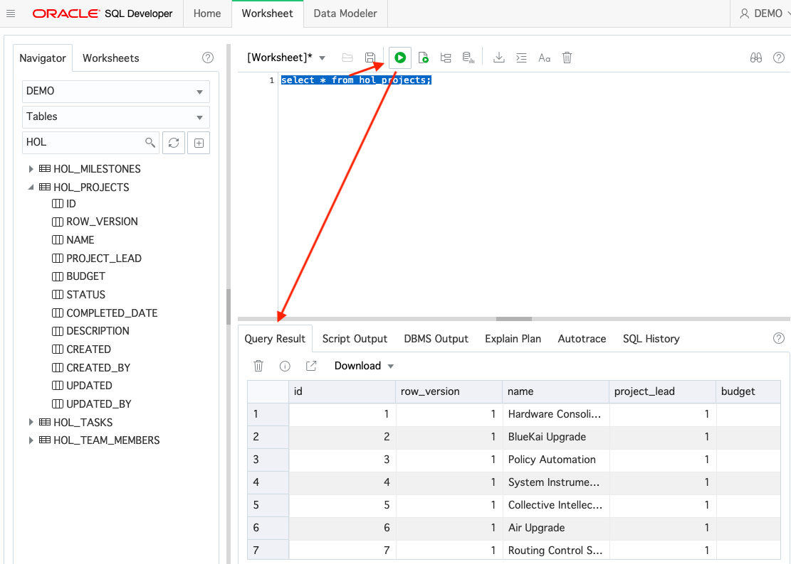

### **Part 3:** View database objects as a data model

In this part, you will learn how to create an Entity Relationship Diagram (ERD) using SQL Developer Web.

1. Click the **Data Modeler** tab and dismiss the Help popup.

   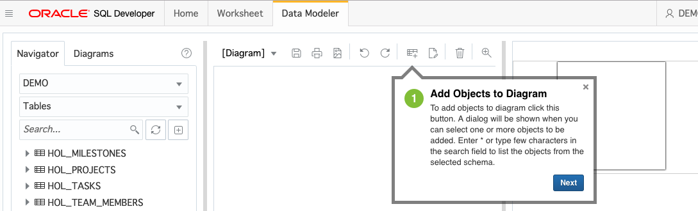

2. Drag the **HOL_MILESTONES** table from the Navigator tab on the left to the diagram in the middle of the window. You may need to adjust your browser to accommodate the ERD.

   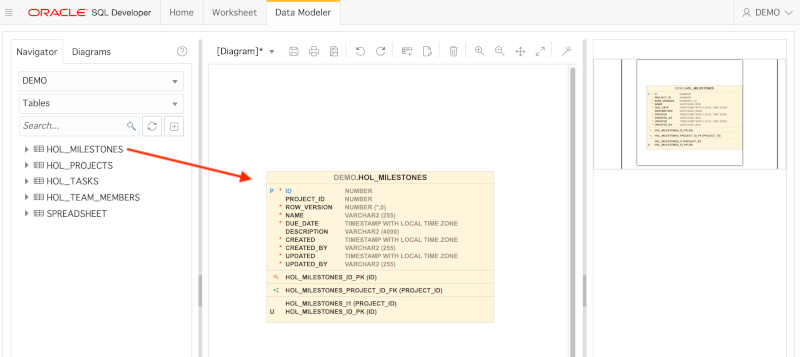

3. Drag the other three **HOL_*** tables to the right. Use the diagram controls to adjust the zoom level and layout of the objects. Note that the foreign keys are detected and drawn on the diagram.

   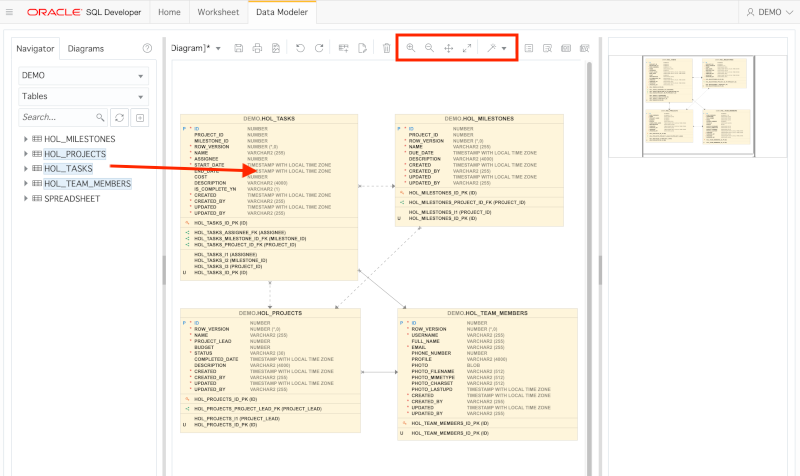

4. Click the **HOL_PROJECTS** table in the diagram. Note that the detail is displayed in the right navigator.

   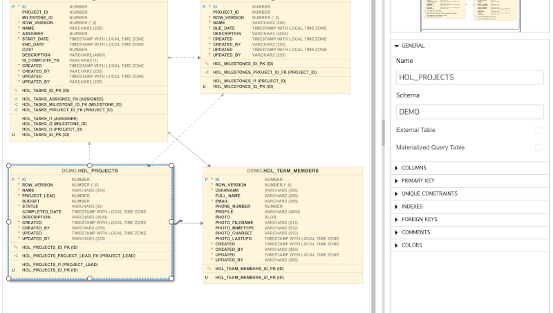

### **Part 4:** Create a new table and add it to the data model

In this part, you will use SQL Developer Web to create a new table. Then you'll learn how to edit an existing table and add it to the ERD created in the previous part.

1. In the Navigator on the left, click the "+" icon.

   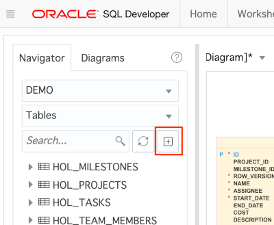

2. Enter **HOL_TODOS** for the Name and click "+" to create a new column.

   

3. Select the new column **NEW_COLUMN_1** and select the checkbox for **PK** to make it the primary key for this new table. In the area at the bottom of the dialog, enter **ID** for Name and select **NUMBER** for Data Type.

   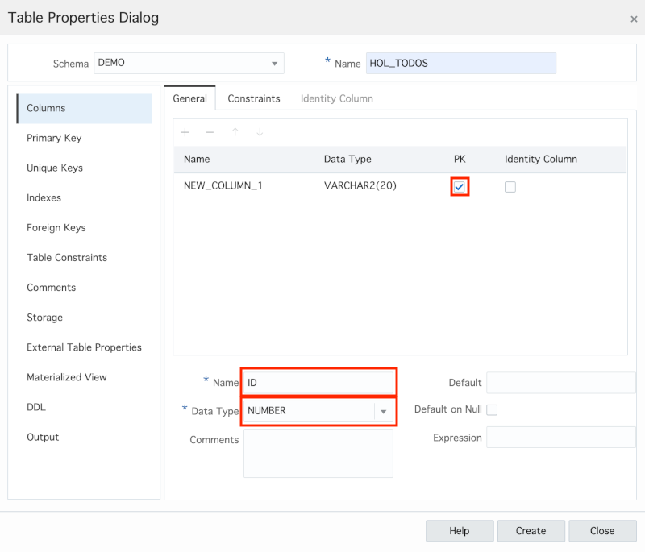

4. Add three more columns with the following properties.

   | # | Name | Data Type |
   | --- | --- | --- |
   | 1 | **NAME** | **VARCHAR2(50)** <br />*(just change the number 20 to 50)* |
   | 2 | **STATUS** | **VARCHAR2(20)** |
   | 3 | **DUE_DATE** | **TIMESTAMP WITH LOCAL TIME ZONE** <br />*(just type the full data type name)* |

   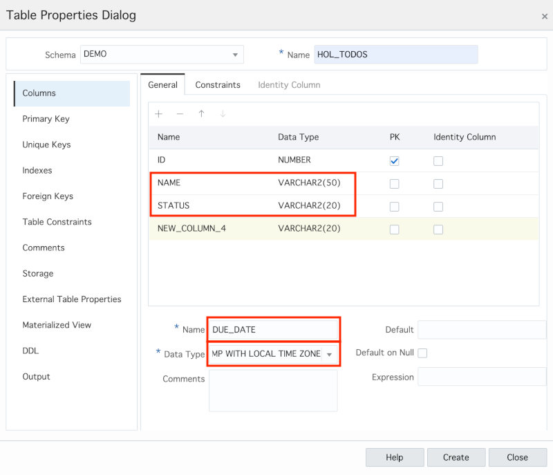

5. Click **Create**. This will generate a SQL script to create the table and execute it. When ready, click **Close**.

   

6. In the Navigator, click the Refresh icon to see the new HOL_TODOS table.

   

7. Right-click on the **HOL_TODOS** table and select **Edit...**.

   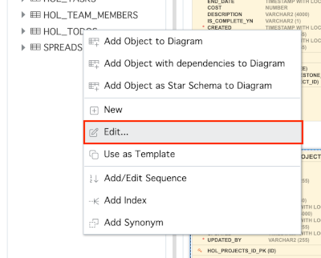

8. Add a new column. Set Name to **TEAM_MEMBER_ID** and Data Type to **NUMBER**, then click **Apply**.

   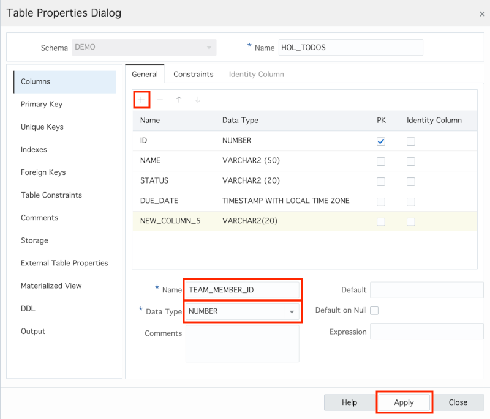

   You should see the following output which indicates the new column was added successfully.

   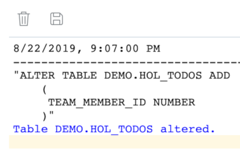

9. Click the **Foreign Key** option on the left side of the dialog, then click "+" to create a new foreign key.

   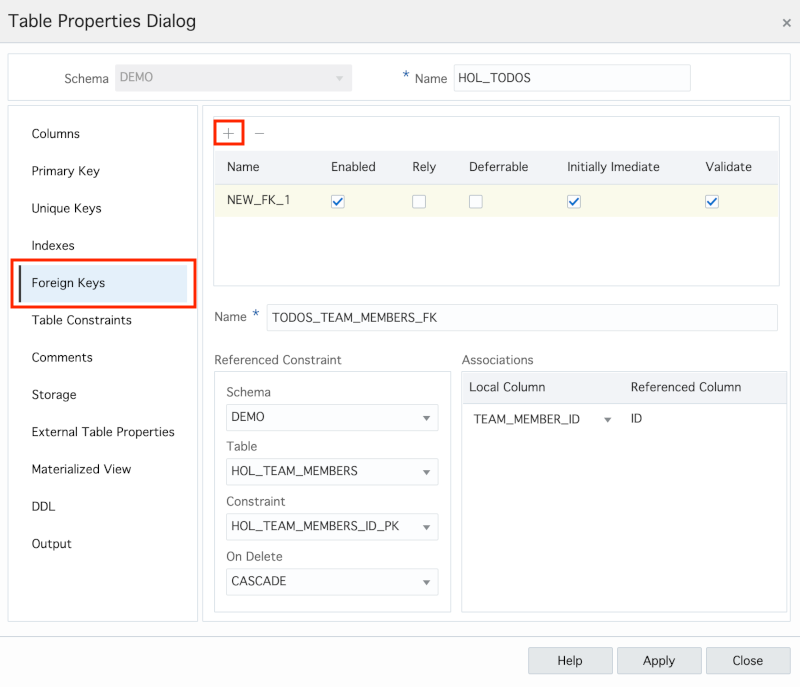

10. Select the new foreign key and configure it with the following settings, then click **Apply**.

    | Property | Value |
    | --- | --- |
    | Name | **TODOS_TEAM_MEMBERS_FK** |
    | Table | **HOL_TEAM_MEMBERS** |
    | Constraint | **HOL_TEAM_MEMBERS_ID_PK** |
    | Local Column | **TEAM_MEMBER_ID** |

    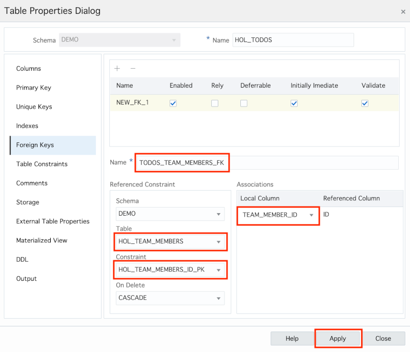

    You should see the following output which indicates the new foreign key was added successfully.

    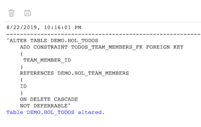

    Click **Close** to dismiss the dialog.

11. Drag the new **HOL_TODOS** table from the Navigator to the diagram. Notice that the new foreign key is displayed between HOL_TEAM_MEMBERS and HOL_TODOS.

    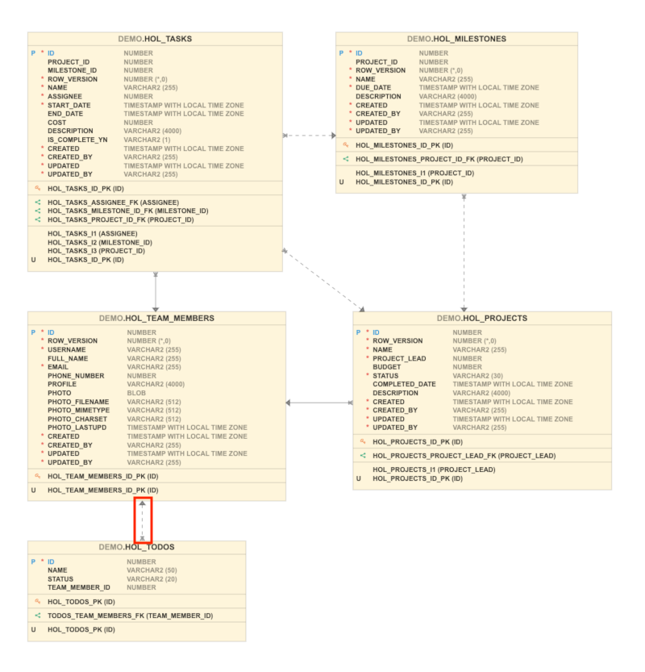

## Summary

This completes Module 3. At this point you know how to use Quick SQL to generate database objects using a SQL shorthand. You also know how to use SQL Developer Web to maintain database objects and generate ERDs. [Click here](4-create-and-modify-an-apex-app.md) to navigate to Module 4.