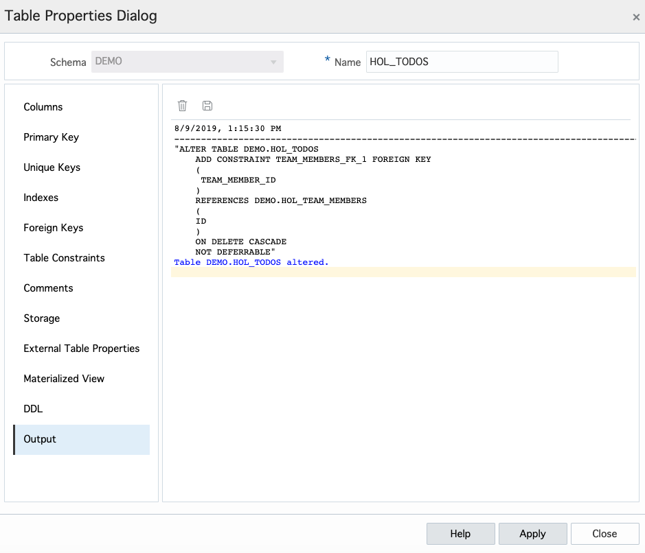

# Module 3: Build Database Objects in Autonomous Database

## Introduction

In this module, you will create database objects using Quick SQL and then view the objects in SQL Developer Web. Then you will then use SQL Developer Web to create an additional table and view all the database objects as a data model.

***To log issues***, click here to go to the [github oracle](https://github.com/oracle/learning-library/issues/new) repository issue submission form.

## Module 3 Objectives

- Create database objects using Quick SQL
- View database objects in SQL Developer Web
- View database objects as a data model
- Create a new table and add it to the data model

## Parts

### **Part 1:** Create database objects using Quick SQL

1. Select **SQL Workshop**, then select **SQL Scripts**.

   

2. Click **Quick SQL**.

   

3. Copy the following SQL shorthand into the left pane Quick SQL window area.

    ```
    team_members /insert 10
      username /nn /upper
      full name
      email /nn
      phone_number
      profile
      photo file
    projects /insert 20
      name /nn
      project_lead /nn /references team_members
      budget num
      status vc30 /nn /check ASSIGNED, IN-PROGRESS, COMPLETED
      completed_date
      description
      milestones /insert 30
        name /nn
        due_date /nn
        description
      tasks /insert 100
        name /nn
        assignee /nn /references team_members
        milestone_id /references milestones
        start_date /nn
        end_date
        cost num
        description
        is_complete_yn /check Y, N
    view project_tasks projects tasks
    ```

4. Review the code and click **Generate SQL**.

   

5. Note the SQL that is generated by default, then click **Settings** to make some changes to the resulting code.

   

6. Change the following settings and click **Save Changes**.

   -  Object Prefix, enter **HOL**
   -  On Delete, select **Restrict**
   -  Primary Keys, select **12c Identity Data Types**
   -  Date Data Type, select **TIMESTAMP WITH LOCAL TIME ZONE**
   -  Include, check **Audit Columns** and **Row Version Number**

   

   

7. Click **Save SQL Script**.

   

8. Enter **HOL** for Script Name and click **Save Script**.

   

9. Click **Review and Run**.

   

10. Click **Run**.

    

11. Click **Run Now**.

    

12. The script ran and you now see the log. Scroll to the bottom to see the summary.

    

    

13. You can view the database objects that were created and view the data that was loaded. Select **SQL Workshop** and select **Object Browser**.

    

14. Search for **HOL** to see the tables you created. Select **HOL_PROJECTS**. Review the columns in the table.

    

15. Click the **Data** tab to see the data that was loaded.

    

### **Part 2:** View database objects in SQL Developer Web

In this part, you will access SQL Developer Web and review the current objects and make some modifications to the data model.

1. Switch to the ATP instance Service Console in your browser. Click the **Development** option in the menu on the left, then select **SQL Developer Web**.

   

2. Log in to SQL Developer Web as the **admin** user.

   

3. You created your database objects in the DEMO schema so you will need to enable SQL Developer Web access for that schema. Use the **Worksheet** to execute the following code:

   ```sql
   begin
 
     ords_admin.enable_schema(
       p_enabled => true,
       p_schema => 'DEMO',
       p_url_mapping_type => 'BASE_PATH',
       p_url_mapping_pattern => 'demo',
       p_auto_rest_auth => true
     );
 
     commit;
     
   end;
   ```

4. Change the URL by replacing **admin** with the value passed to the **p_url_mapping_pattern** parameter in the script above.

   

5. Log in as the **demo** user.

   

6. The Worksheet tab is displayed. Close the help popup.

   

7. To see all the tables you added previously, in the search area, enter **HOL** and click the refresh button.

   

8. All the tables you created are displayed. Expand the **HOL_PROJECTS** table to see the columns.

   

9. Enter the following SQL in the right area and click the "run" icon to see the data in the table.

   ```sql
   select * from hol_projects;
   ```

   The data should be displayed in the Query Result tab at the bottom.

   

### **Part 3:** View database objects as a data model

1. Let's view the tables in a data model diagram. Click the **Data Model** tab. Close the Help popup.

   

2. Search for **HOL** again and click **Refresh**. Then drag the **HOL_MILESTONES** table to the right side of the window.

   

3. Drag the other three tables to the right. Note that the foreign keys are detected and drawn on the data model.

   

4. Click the **HOL_PROJECTS** table in the diagram. Note that the detail is displayed in the right navigator.

   

### **Part 4:** Create a new table and add it to the data model

1. You want to create a new table. In the Navigator, click the **'+'** icon.

   

2. Enter **HOL_TODOS** for the table name and click the **'+'** to create a new column.

   

3. Select the new column **NEW_COLUMN_1** and in the area at the bottom of the dialog, enter **id** for Name and select **NUMBER** for Data Type. Also select the checkbox for **PK** to make it the primary key for this new table. Click **'+'** to create another column.

   

4. Create the following columns and then click **Apply**.
**NAME - VARCHAR(50)** (Note, just change the number 20 to 50)
**STATUS = VARCHAR(20)**

   

5. The script is generated and is executed. Click **Close**.

   

6. In the Navigator, click the Refresh icon to see the new HOL_TODOS table.

   

7. You want to be able to assign a team member to a todo so you want to create a new column called TEAM_MEMBER_ID and create a foreign key to the HOL_TEAM_MEMBERS table. Right-click on the **HOL_TODOS** table and select **Edit...**.

   

8. Add a new column called **TEAM_MEMBER_ID** and click **Apply**.

   

9. The script to create the new column ran successfully. 

   

10. Click the **Foreign Key** option on the left side of the dialog.

   

-  Click the '+' to create a new foreign key. Select it in the list and change the name to TEAM_MEMBER_ID. 

   

11. The script to create the new column ran successfully. Click the **Foreign Key** option on the left side of the dialog. Select the **HOL_TEAM_MEMBERS** table and select the **HOL_TEAM_MEMBERS_ID_PK** constraint. On the right side, select **TEAM_MEMBER_ID** for local column and click **Apply**.

    

12. The script to create the foreign key ran successfully. Click **Close**.

    

13. Drag the new HOL_TODOS table from the Navigator to the Diagram. You notice that the new foreign key is displayed between HOL_TEAM_MEMBERS and HOL_TODOS.

    
