# Module 4: Create and Modify an APEX App

## Introduction

In this module, you will create a new application that will utilize the database objects you created in the previous module. You will create and modify an application with an Interactive Grid and Calendar page.

***To log issues***, click here to go to the [github oracle](https://github.com/oracle/learning-library/issues/new) repository issue submission form.

## Module 4 Objectives

- Create an Interactive Grid
- Enhance the Interactive Grid
- Save the report settings
- Add a Calendar page

## Parts

### **Part 1:** Create an Interactive Grid

1. Click **Create App from Script**. Note: If you are back on SQL Scripts and don’t see the **Create App from Script** button, perform the following steps:
   - Within the Results column, click “1” for the script you just ran.
   - Under View Results, click the magnifying glass. The results page shown above should now be displayed again.

   

2. For Name, enter **Projects** and click **Appearance**. For Theme Style, select **Vita-Slate** and click **Save Changes**.

   

3. For Features, click **Check All**.

   

4. Click **Create Application**.

  

5. Your new application will be displayed in Page Designer. Click **Run Application**.

   

6. Enter your credentials and review your new application.

   

7. From the development environment, click **App Builder**, and then select **Create**.

   

8. Click **New Application**.

   

9. In the Create App Wizard, click **Load Blueprint** and for Projects, click **Load**. 

   

10. Click **Add Page** and then click **Interactive Grid**.

    

11. For Page Name, enter **Milestones**, for Table or View, select **HOL_MILESTONES** and click **Add Page**.

    

12. Click and hold the mouse when hovering over the hamburger for the Milestones – Interactive Grid page. Move it up until the page is under Projects and release the mouse.

    

13. For Milestones – Interactive Report with Form page, click **Edit** and then click **Delete**.

    

14. Click **Create Application**. In Page Designer, click **Run Application**.

    

15. In the runtime environment, click **Milestones**.

    

### **Part 2:** Enhance the Interactive Grid

1. In the Developer Toolbar, click **Edit Page 6**.

   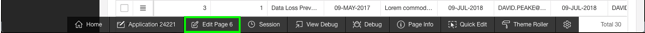

2. In Page Designer, under Milestones, click **Columns** and click **PROJECT_ID**.

   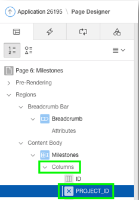

3. In the Property Editor, update the following and click **Save and Run the App**.
   -  Identification: Type – select **Select List**
   -  Heading: Heading – enter **Project**
   -  List of Values: Type – select **SQL Query**
   -  List of Values – SQL Query enter **select name d, id r from hol_projectsorder by 1**
   -  Display Extra Values – click **No**
   -  Display Null Value – click **No** 

   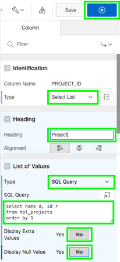

4. Select one of the projects in the list and you see that it is now a select list.

   

5. Select the list to see all the projects you can select from.

   

6. You can also select one of the Due Date values to see the Date Picker widget is available.

   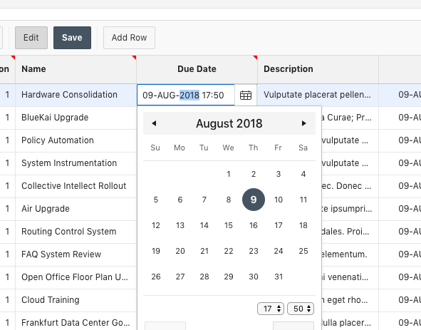

7. You can change the columns that are displayed. Click **Actions** and select **Columns**.

   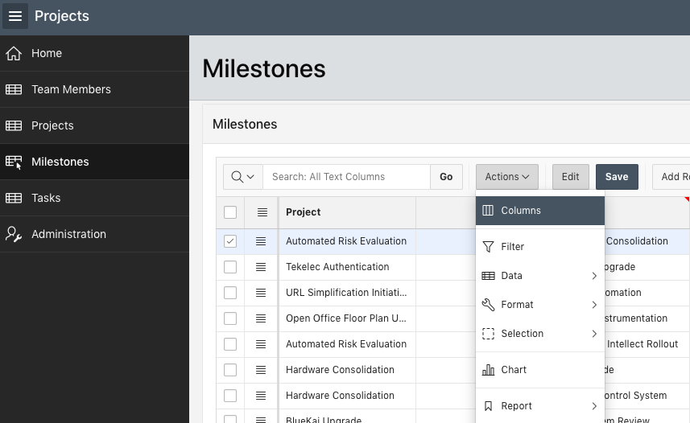

8. Uncheck some of the columns. In this case, uncheck Row Version, Updated and Updated By and click **Save**.

   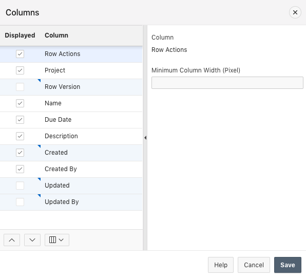

9. To see all of the Milestones grouped by Project, you need to add a control break on the **Project** column. Click **Actions** and select **Format** > **Control Break**.

   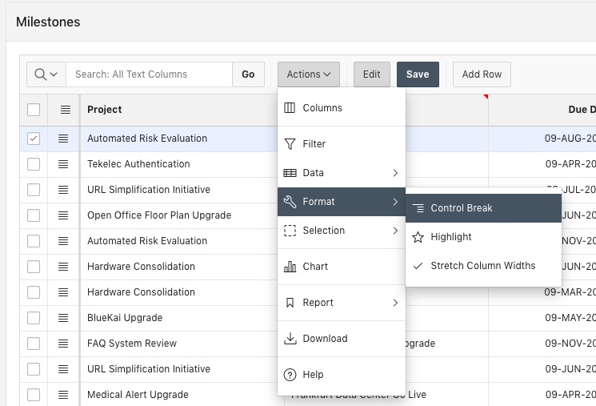

10. Select the **+** and select the **Project** column, then click **Save**.

    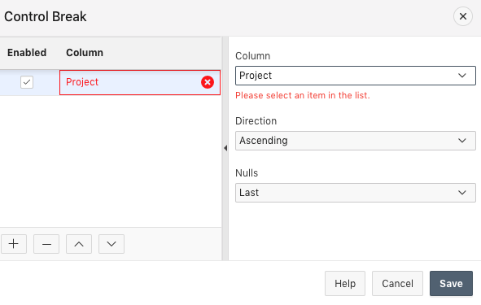

11. Note that the control break on Project was applied.

    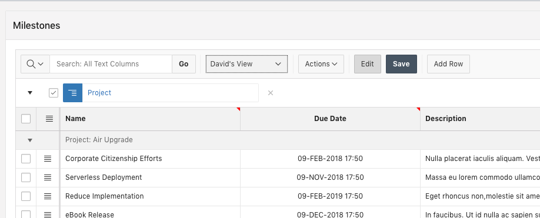

### **Part 3:** Save the report settings

1. You want to save this report so you don't need to apply the changes you just made every time. Click **Actions**, select **Report**, select **Save As**.

   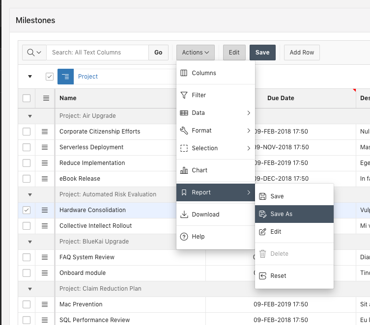

2. Select **Alternative** for Type, enter a Name and click **Save**.

   

3. Note the Report List in the Interactive Tool bar is now available. If you want to go back to the Primary Report, you can select it from the list.

   

### **Part 4:** Add a Calendar page

1. You want to create a schedule of all your projects in a calendar. Click the Application link in the developer toolbar.

   

2. Click **Create Page**.

   

3. Select **Calendar** and click **Next**.

   

4. Enter **Calendar** for Page Name, select **Breadcrumb** for Breadcrumb and click **Next**.

   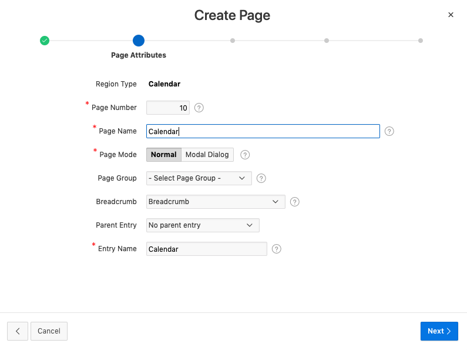

5. Select **Create a new navigation menu entry** and click **Next**.

   

6. Select **HOL_PROJECTS** for Table / View Name and make sure only the following columns are in the right column and click **Next**.

   - ID
   - ROW Version
   - Name
   - PROJECT_LEAD
   - STATUS
   - COMPLETED_DATE

   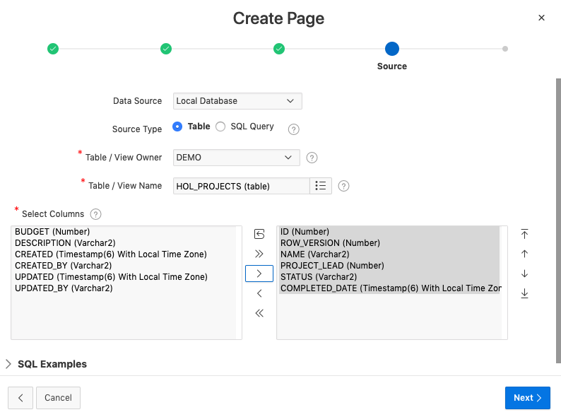 

7. Select **NAME** for Display Column, **COMPLETED_DATE** for Start Date Column and End Date Column and click **Create**.

   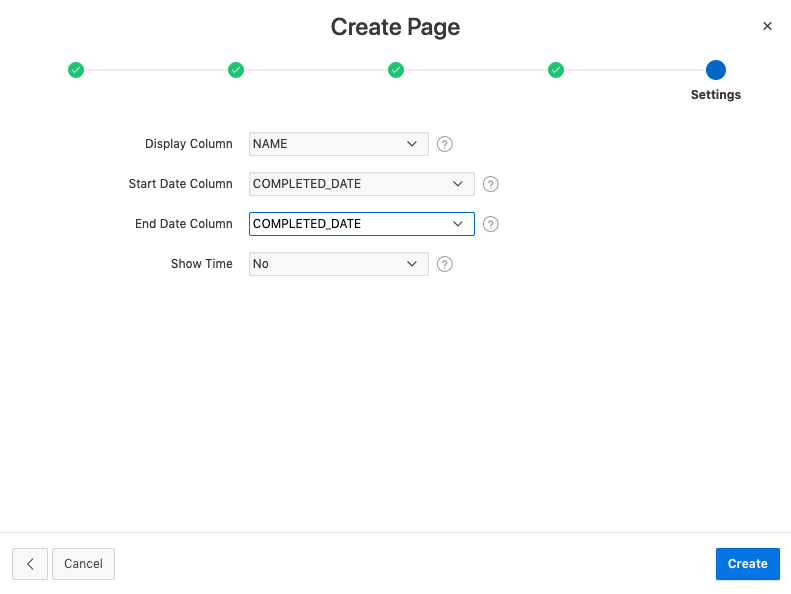

8. Click **Save and Run Page**.

   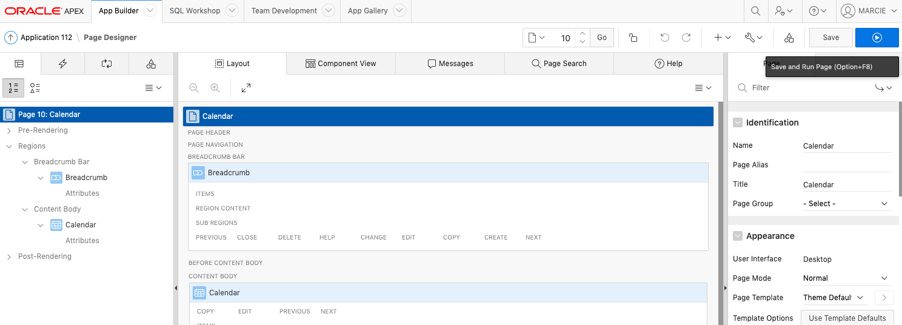

9. The Calendar is displayed. You may need to change the month to see any projects. Note that the new Calendar page is an entry in the Navigation Menu.

   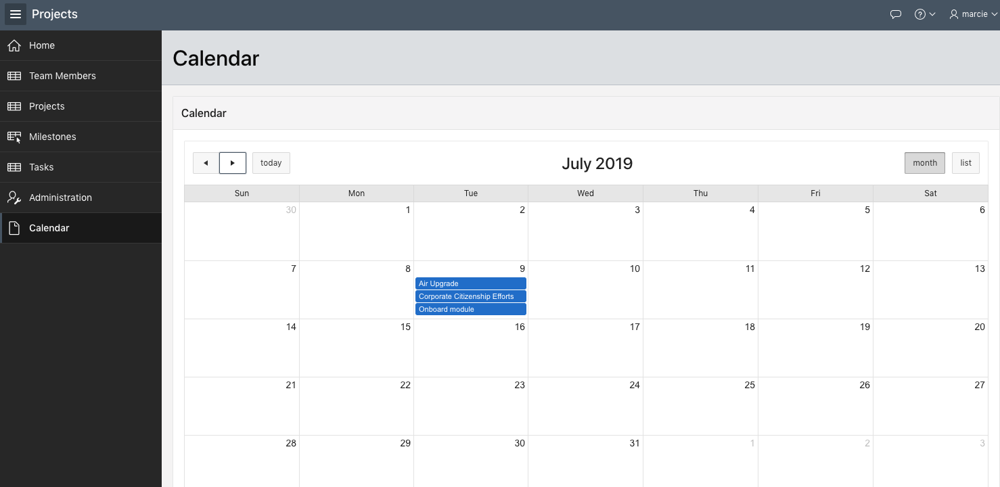

**This completes the Lab!**
