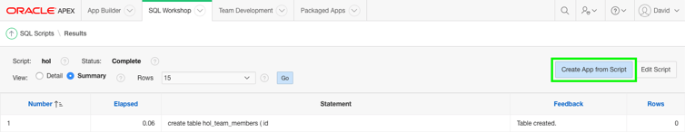
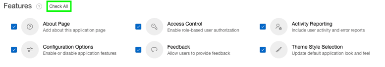
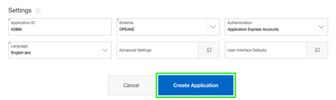
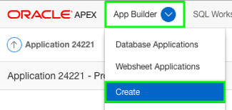
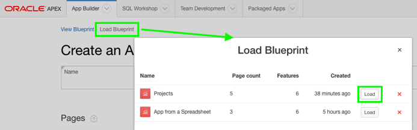
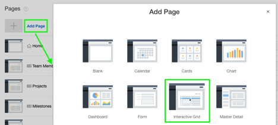
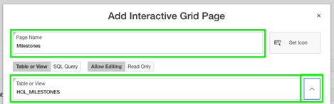
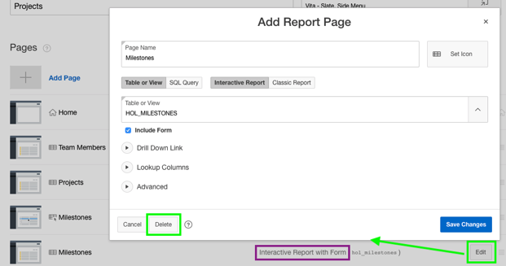
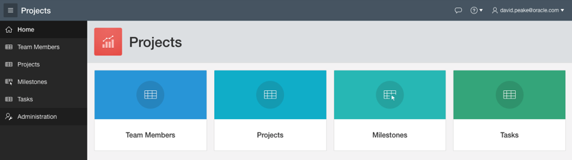

# Module 4: Create and Modify an APEX App

## Introduction

In this module, you will create a new APEX application that will utilize the database objects you created in the previous module. You will then extend the application by adding an Interactive Grid page and a Calendar page.

***To log issues***, click here to go to the [github oracle](https://github.com/oracle/learning-library/issues/new) repository issue submission form.

## Module 4 Objectives

- Create an app from a script
- Add an Interactive Grid page and create records (todos)
- Enhance and save the Interactive Grid (team member lov, static lov for status, control break on status, reorder columns, sort by team member, save the report)
- Add a Calendar page (on tasks) (create link to the form page)

## Parts

### **Part 1:** Create an app from a script

In Module 3, Part 1, you used Quick SQL to create a script which you subsequently ran to create several tables. The Results page of running the script has a button that allows you to create a new application based on the script. APEX will parse the script to identify the tables and then create pages in the new app to view and edit data within those tables. In this part, you will create an app based on the script you previously ran.

1. Return to your APEX Workspace. You may need to re-authenticate if your previous session expired. If you need the APEX URL, return to the ATP Service Console, click **Development** in the menu on the left, then select the **Oracle Application Express** option. To log in, enter **DEMO** for the Workspace and Username fields and **`SecretPassw0rd`** for the password, then click **Sign In**.

   

2. Click the down arrow in the **SQL Workshop** tab, then select **SQL Scripts**.

   
3. Click the number link in the Results column to view the results of the previous runs of the script.

   
4. Click the magnifying glass icon in the View Results column.

   
5. Click **Create App from Script**.

   
6. Set Name to **App from a Script** and then click the popup icon for Appearance. In the dialog, select **Vita - Slate** and then click **Save Changes**.

   

   Next, click **Check All** for Features and then click **Create Application**.

   
   
   After the app is created, you'll be redirected to the application home page in the Application Builder.
7. Click **Run Application** to see the app at runtime. 

   
8. Take a moment to explore the pages that APEX created on top of the tables identified in the script.

  

1. Click **Create App from Script**. Note: If you are back on SQL Scripts and don’t see the **Create App from Script** button, perform the following steps:
   - Within the Results column, click “1” for the script you just ran.
   - Under View Results, click the magnifying glass. The results page shown above should now be displayed again.

   

2. For Name, enter **Projects** and click **Appearance**. For Theme Style, select **Vita-Slate** and click **Save Changes**.

   

3. For Features, click **Check All**.

   

4. Click **Create Application**.

  

5. Your new application will be displayed in Page Designer. Click **Run Application**.

   

6. Enter your credentials and review your new application.

   

7. From the development environment, click **App Builder**, and then select **Create**.

   

8. Click **New Application**.

   

9. In the Create App Wizard, click **Load Blueprint** and for Projects, click **Load**. 

   

10. Click **Add Page** and then click **Interactive Grid**.

    

11. For Page Name, enter **Milestones**, for Table or View, select **HOL_MILESTONES** and click **Add Page**.

    

12. Click and hold the mouse when hovering over the hamburger for the Milestones – Interactive Grid page. Move it up until the page is under Projects and release the mouse.

    

13. For Milestones – Interactive Report with Form page, click **Edit** and then click **Delete**.

    

14. Click **Create Application**. In Page Designer, click **Run Application**.

    

15. In the runtime environment, click **Milestones**.

    

### **Part 2:** Add an Interactive Grid page and create records

Thus far, you've used high-level wizards to generate applications: first from a spreadsheet and then from a script. In this part, you'll work at a lower level to add a new Interactive Grid page the application created in the previous part. After that, you'll use the new page to add some data to the HOL_TODOS table.

1. todo

### **Part 3:** Enhance and save the Interactive Grid

A page in APEX is made up of various components, such as regions, items, and buttons. Once created, these components can be declaratively configured via the Page Designer, an IDE like tool built into APEX. In this part, you'll use the Page Designer to make some changes to the Interactive Grid region created in the previous step. You'll then make some additional changes to the appearance of the Interactive Grid. 

1. todo

### **Part 4:** Add a Calendar page

APEX includes different components for viewing and working with data in different ways, including forms, reports, charts, and much more. One of the easiest ways to visualize data related to dates is with a calendar. In this part, you'll create a new calendar page in your application to view data in the HOL_TASKS table. 

1. todo

## Summary

You have completed the lab, well done! 
