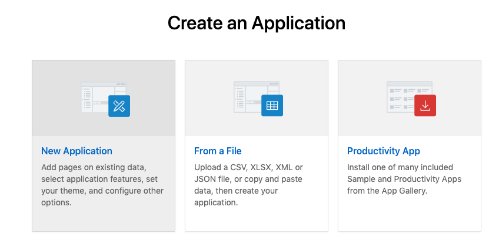
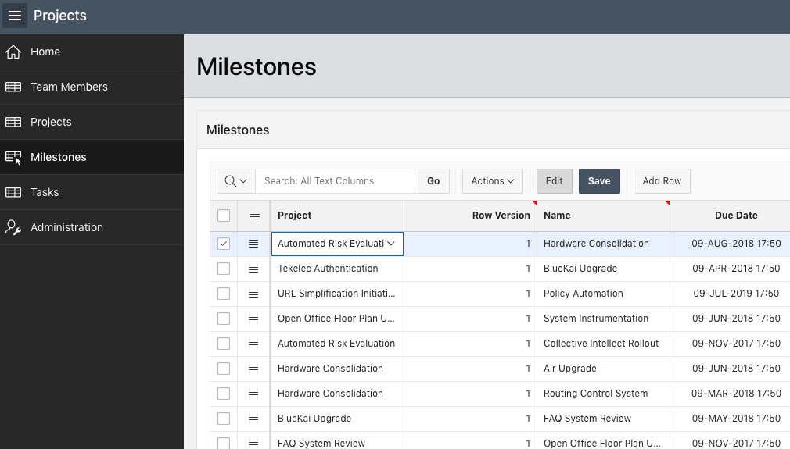
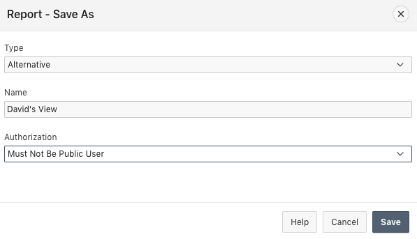
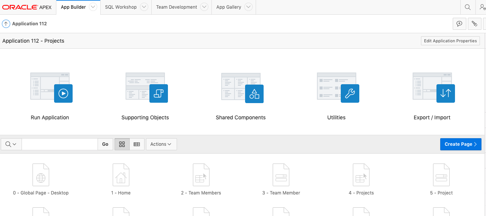
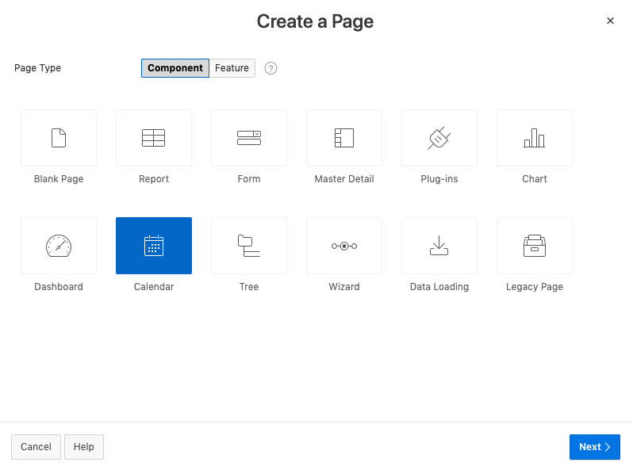
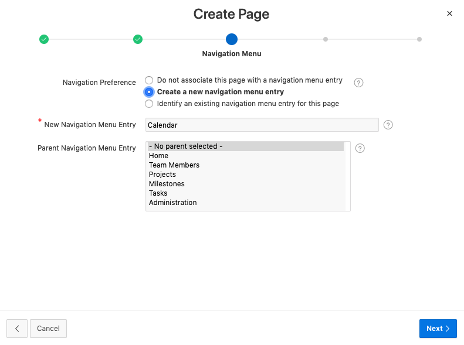

# Module 4: Create and Modify an APEX App

## Introduction

In this module, you will create a new application that will utilize the database objects you created in the previous module. You will create and modify an application with an Interactive Grid and Calendar page.

***To log issues***, click here to go to the [github oracle](https://github.com/oracle/learning-library/issues/new) repository issue submission form.

## Module 4 Objectives

- Create an Interactive Grid
- Enhance the Interactive Grid
- Save the report settings
- Add a Calendar page

## Parts

### **Part 1:** Create an Interactive Grid

1. Click **Create App from Script**. Note: If you are back on SQL Scripts and don’t see the “Create App from Script” button, perform the following steps:
   - Within the Results column, click “1” for the script you just ran.
   - Under View Results, click the magnifying glass. The results page shown above should now be displayed again.

   

2. For Name, enter **Projects** and click **Appearance**. For Theme Style, select **Vita-Slate** and click **Save Changes**.

   

3. For Features, click **Check All**.

   

4. Click **Create Application**.

  

5. Your new application will be displayed in Page Designer. Click **Run Application**.

   

6. Enter your credentials and review your new application.

   

7. From the development environment, click **App Builder**, and then select **Create**.

   

8. Click **New Application**.

   

9. In the Create App Wizard, click **Load Blueprint** and for Projects, click **Load**. 

   

10. Click **Add Page** and then click **Interactive Grid**.

   

11. For Page Name, enter **Milestones**, for Table or View, select **HOL_MILESTONES** and click **Add Page**.

   

12. Click and hold the mouse when hovering over the hamburger for the Milestones – Interactive Grid page. Move it up until the page is under Projects and release the mouse.

   

13. For Milestones – Interactive Report with Form page, click **Edit** and then click **Delete**.

   

14. Click **Create Application**. In Page Designer, click **Run Application**.

   

15. In the runtime environment, click **Milestones**.

   

### **Part 2:** Enhance the Interactive Grid

- In the Developer Toolbar, click **Edit Page 6**.

  

- In Page Designer, under Milestones, click **Columns** and click **PROJECT_ID**.

  

- In the Property Editor, update the following and click **Save and Run the App**.
  -  Identification: Type – select **Select List**
  -  Heading: Heading – enter **Project**
  -  List of Values: Type – select **SQL Query**
  -  List of Values – SQL Query enter **select name d, id r from hol_projectsorder by 1**
  -  Display Extra Values – click **No**
  -  Display Null Value – click **No** 

  

- Select one of the projects in the list and you see that it is now a select list.

  

- Select the list to see all the projects you can select from.

  

- You can also select one of the Due Date values to see the Date Picker widget is available.

  

- You can change the columns that are displayed. Click **Actions** and select **Columns**.

  

- Uncheck some of the columns. In this case, uncheck Row Version, Updated and Updated By and click **Save**.

  

- You want to see all the Milestones by Project so you will need to add a control break on Project. Click **Actions** and select **Format** > **Control Break**.

  

- Select the **+** and select the **Project** column, then click **Save**.

  

- Note that the control break on Project was applied.

  

### **Part 3:** Save the report settings

- You want to save this report so you don't need to apply the changes you just made every time. Click **Actions**, select **Report**, select **Save As**.

  

- Select **Alternative** for Type, enter a Name and click **Save**.

  

- Note the Report List in the Interactive Tool bar is now available. If you want to go back to the Primary Report, you can select it from the list.

  

### **Part 4:** Add a Calendar page

- You want to create a schedule of all your projects in a calendar. Click the Application link in the developer toolbar.

  

- Click **Create Page**.

  

- Select **Calendar** and click **Next**.

  

- Enter **Calendar** for Page Name, select **Breadcrumb** for Breadcrumb and click **Next**.

  

- Select **Create a new navigation menu entry** and click **Next**.

  

 - Select **HOL_PROJECTS** for Table / View Name and make sure only the following columns are in the right column and click **Next**.

   - ID
   - ROW Version
   - Name
   - PROJECT_LEAD
   - STATUS
   - COMPLETED_DATE

   

- Select **NAME** for Display Column, **COMPLETED_DATE** for Start Date Column and End Date Column and click **Create**.

  

- Click **Save and Run Page**.

  

- The Calendar is displayed. You may need to change the month to see any projects. Note that the new Calendar page is an entry in the Left Navigation.

  

**This completes the Lab!**
