# Module 4: Create and Modify an APEX App

## Introduction

In this module, you will create a new APEX application that will utilize the database objects you created in the previous module. You will then extend the application by adding Interactive Grid and Calendar pages.

***To log issues***, click here to go to the [github oracle](https://github.com/oracle/learning-library/issues/new) repository issue submission form.

## Module 4 Objectives

- Create an app from a script
- Add an Interactive Grid page and create records
- Enhance the Interactive Grid
- Add a Calendar page

## Parts

### **Part 1:** Create an app from a script

In Module 3, Part 1, you used Quick SQL to create a script which you subsequently ran to create several tables. The script's Results page has a button that allows you to create a new application based on the script. APEX will parse the script to identify the tables and then create pages in the new app to view and edit data within those tables. In this part, you will create an app based on the script you previously ran.

1. Return to your APEX Workspace. You may need to re-authenticate if your previous session expired. If you need the APEX URL, return to the ATP Service Console, click **Development** in the menu on the left, then select **Oracle Application Express**. To log in, enter **DEMO** for the Workspace and Username fields and **`SecretPassw0rd`** for the password, then click **Sign In**.

   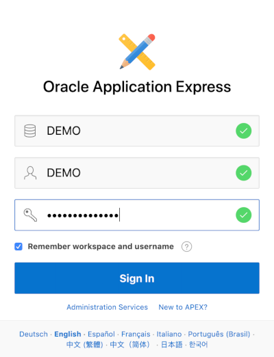

2. Click the down arrow in the **SQL Workshop** tab, then select **SQL Scripts**.

   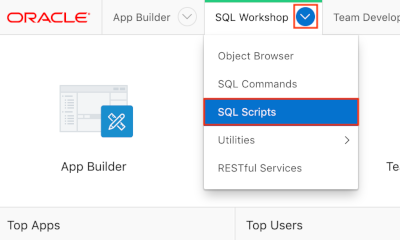
3. Click the number link in the Results column to view the results of the previous runs of the script.

   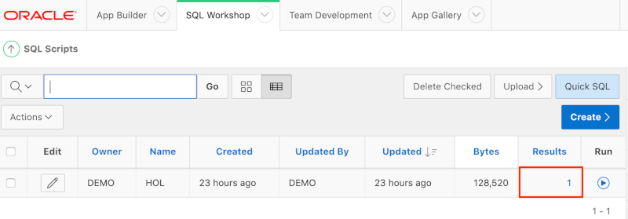
4. Click the magnifying glass icon in the View Results column.

   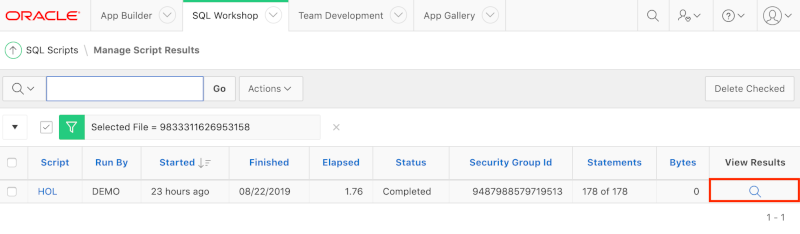
5. Click **Create App from Script**.

   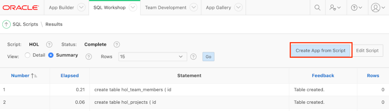
6. Set Name to **App from a Script** and then click the popup icon for Appearance. In the dialog, select **Vita - Slate** and then click **Save Changes**.

   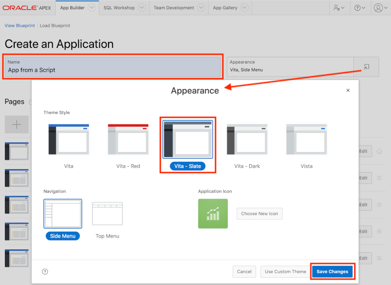

   Next, click **Check All** for Features and then click **Create Application**.

   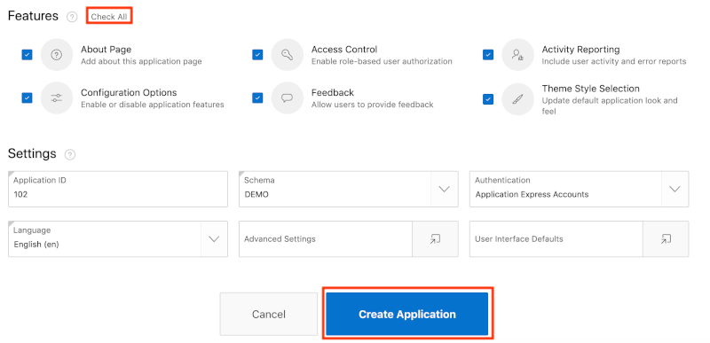
   
   After the app is created, you'll be redirected to the application home page in the Application Builder.
7. Click **Run Application** to see the app at runtime. 

   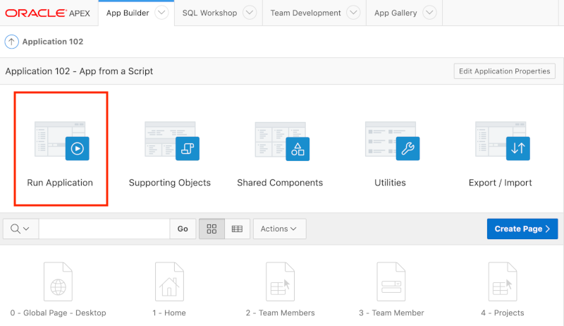
8. Take a moment to explore the pages that APEX created on top of the tables identified in the script.

   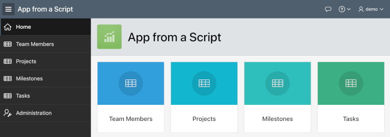

### **Part 2:** Add an Interactive Grid page and create records

Thus far, you've used high-level wizards to generate applications, first from a spreadsheet and then from a script. In this part, you'll work at a lower level to add a new Interactive Grid page the application. After that, you'll use the new Interactive Grid to add some data to the HOL_TODOS table.

1. Return to the application's home page in the Application Builder, then click **Create Page >**.

   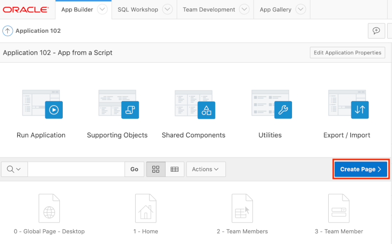

2. Click **Form**.

   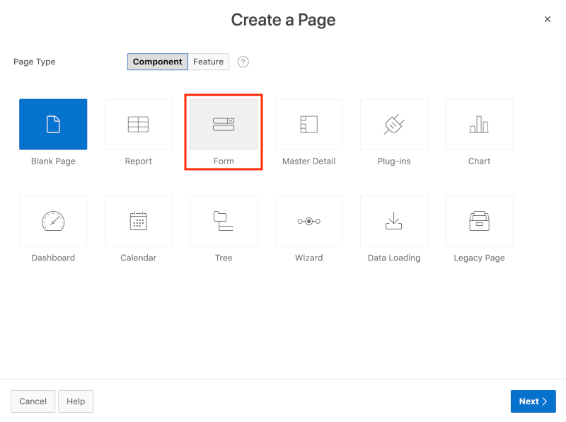

3. Click **Editable Interactive Grid**.

  

4. Set Page Name to **Todos**, then click **Next >**.

  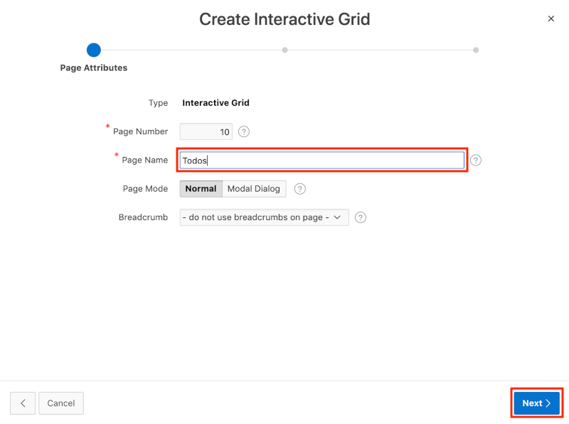

5. For Navigation Preference, select **Create a new navigation menu entry**, then click **Next >**.

  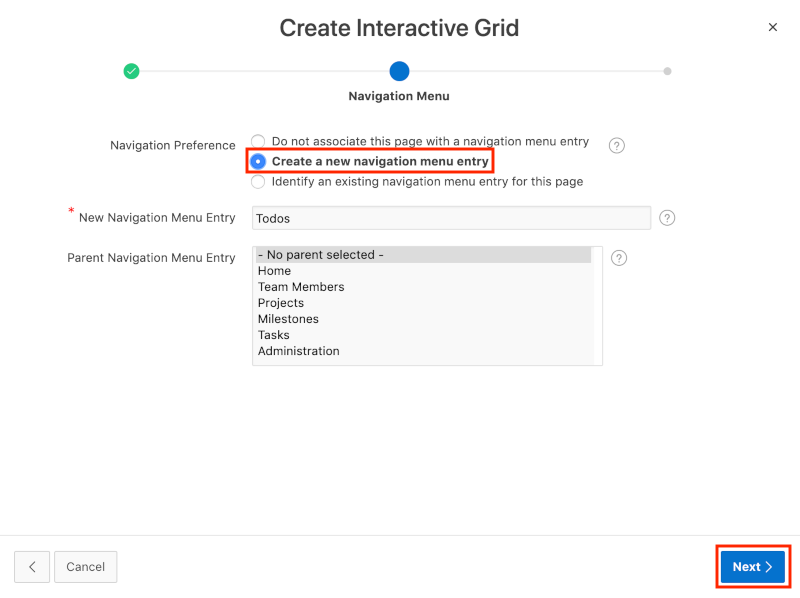

6. For Table / View Name, use the popup to select **HOL_TODOS (table)**, then click **Create**.

   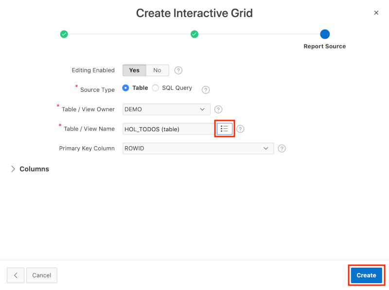

7. After the page is created, you will be redirected to the Page Designer (an IDE like interface) for the new page. To view the runtime for the new page, click the "Save and Run Page" button in the upper right-hand corner.

   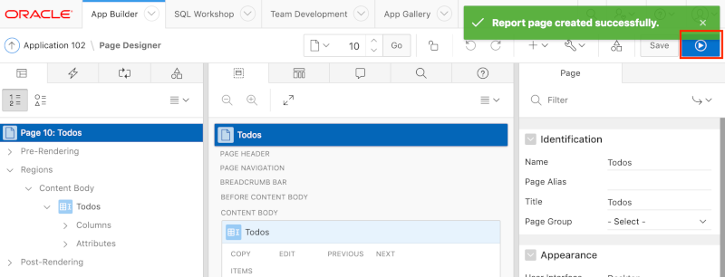

   The new Interactive Grid page will open in a different browser tab. Note that a new navigation menu item has been added on the left as well.

   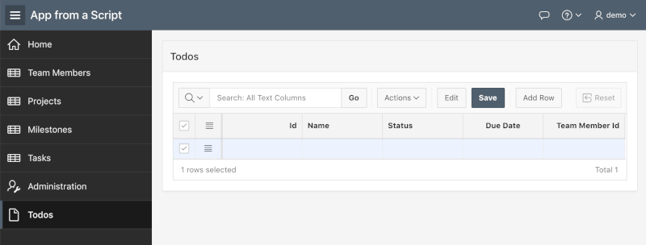

8. Since there is no data in the HOL_TODOS table, the Interactive Grid displays one empty record by default. Use the **Add Row** button to add two more empty rows, populate the columns as follows, then click **Save**. Don't populate the additional columns yet, you'll do that in the next part.

    | Id | Name |
    | --- | --- |
    | **1** | **Fix bugs** |
    | **2** | **Test app** |
    | **3** | **Deploy to production** |

   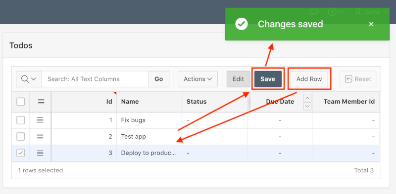

### **Part 3:** Enhance the Interactive Grid

A page in APEX is made up of various components, such as regions, items, and buttons. Once created, these components can be configured via the Page Designer. In this part, you'll use the Page Designer to make some changes to the Interactive Grid region created in the previous part. You'll then make some additional changes to the appearance of the Interactive Grid. 

1. At the bottom of the runtime page, you'll see the Developer Toolbar (only displayed to developers). Click **Edit Page 10** to return to the Page Designer for page 10 (your page number may be different).

   

2. The Page Designer has three panes, each of which contains different tabs. The default tab in the left pane is the Rendering tab, which displays the various components involved with rendering the page. Expand the columns under the **Todos** region and select **DUE_DATE**. The Property Editor tab in the right pane will display the properties for the selected column. Set the Format Mask to **DD-MON-YYYY**.

   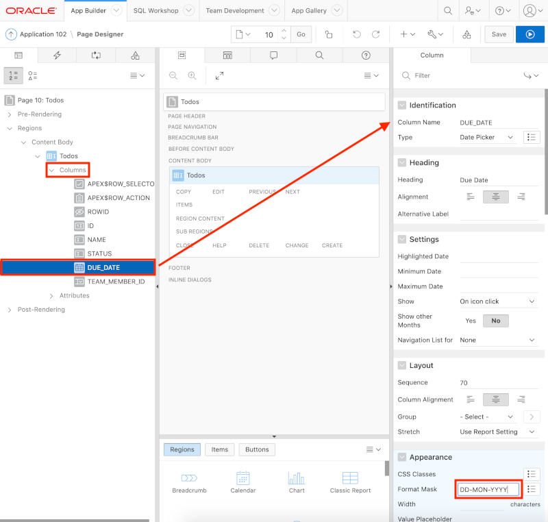

3. When it comes to foreign key columns, it's often best to use a List of Values item that displays one thing to the end user from a lookup table, but returns the foreign key value behind the scenes. This is known as a dynamic list of values. Select the **TEAM_MEMBER_ID** column in the left pane and configure the properties of the column in the right pane as follows.

    | Group | Property | Value |
    | --- | --- | --- |
    | Identification | Type | **Select List** |
    | Heading | Heading | **Team Member** |
    | List of Values | Type | **SQL Query** |
    | List of Values | SQL Query |**<pre style="padding:0;overflow-x:auto;background:none;">select full_name d, id r from hol_team_members order by d</pre>** |

   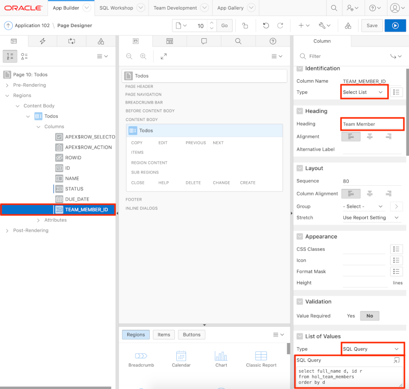

4. In addition to dynamic lists of values, it's sometimes beneficial to create a static list of values to constrain a user's input in a field. Select the **STATUS** column in the left pane and configure the properties of the column in the right pane as follows.

    | Group | Property | Value |
    | --- | --- | --- |
    | Identification | Type | **Select List** |
    | List of Values | Type | **Static Values** |
    | List of Values | Static Values | \**Use the popup to edit* <table><thead><tr><th>Display Value</th><th>Return Value</th></tr><tr><td>**Pending**</td><td>**Pending**</td></tr><tr><td>**Complete**</td><td>**Complete**</td></tr></thead></table> |

   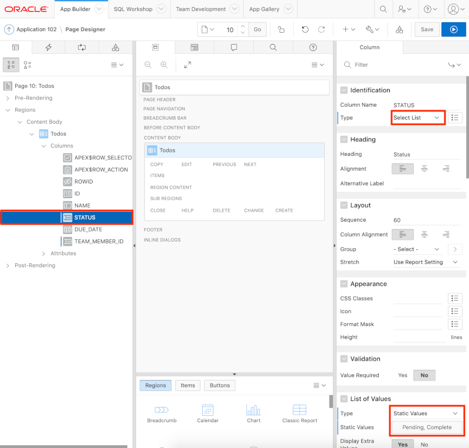

5. Click the "Save and Run Page" button.

   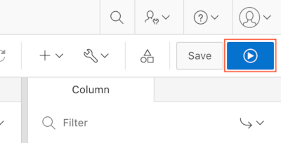

   This will re-render the runtime page with the new settings. Try editing the last three columns to see how your updates affected the Interactive Grid.

   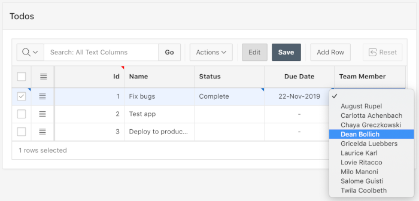

### **Part 4:** Add a Calendar page

APEX includes different components for viewing and working with data in different ways, including forms, reports, charts, and much more. One of the easiest ways to visualize data related to dates is with a calendar. In this part, you'll create a new calendar page in your application to view data in the HOL_PROJECTS table. 

1. Click the **Application 102** link (your app number may be different) in the Developer Toolbar. This will return you to the application's home page in the Application Builder.

   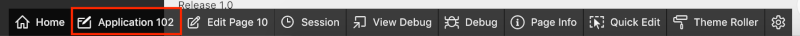

2. Click **Create Page**.

   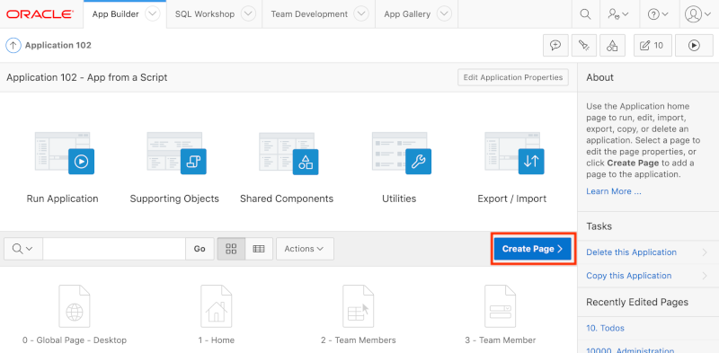

3. Click **Calendar**.

   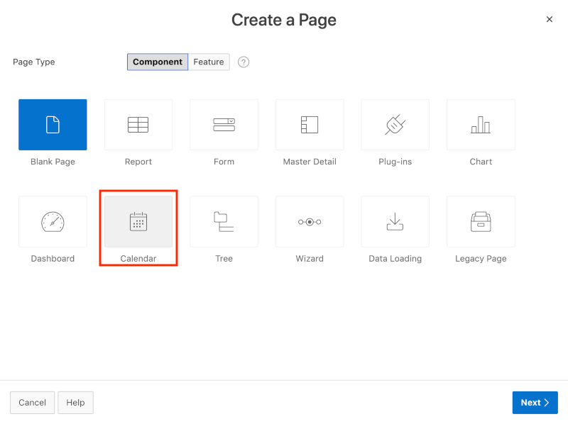

4. Set Page Name to **Calendar**, then click **Next >**.

   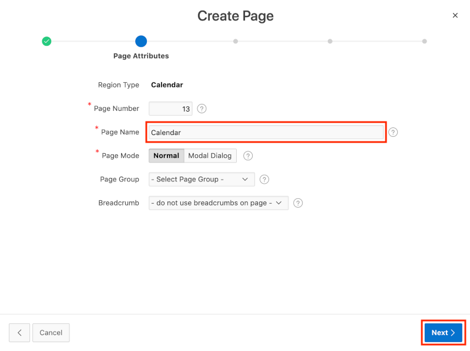

5. For Navigation Preference, select **Create a new navigation menu entry**. Set Parent Navigation Menu Entry to **Projects**, then click **Next >**.

   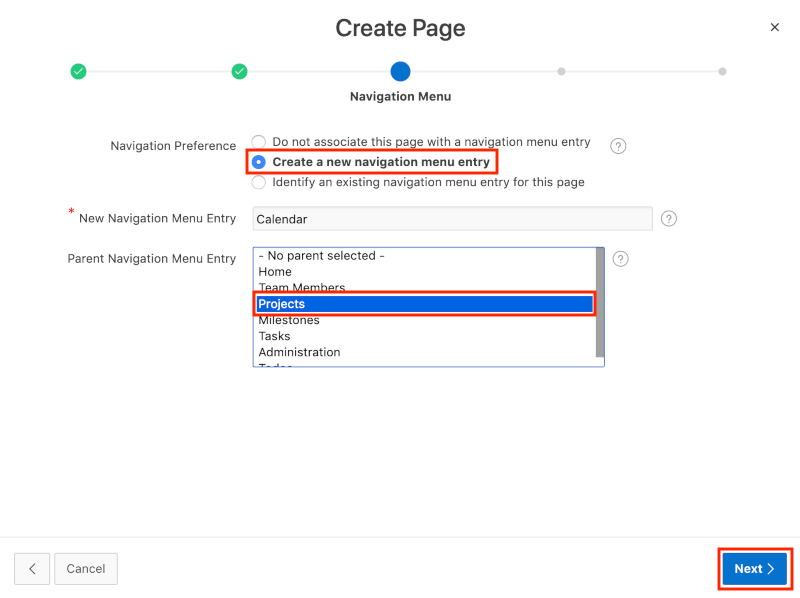

6. For Table / View Name, use the popup to select **HOL_PROJECTS (table)**, then click **Next >**.

   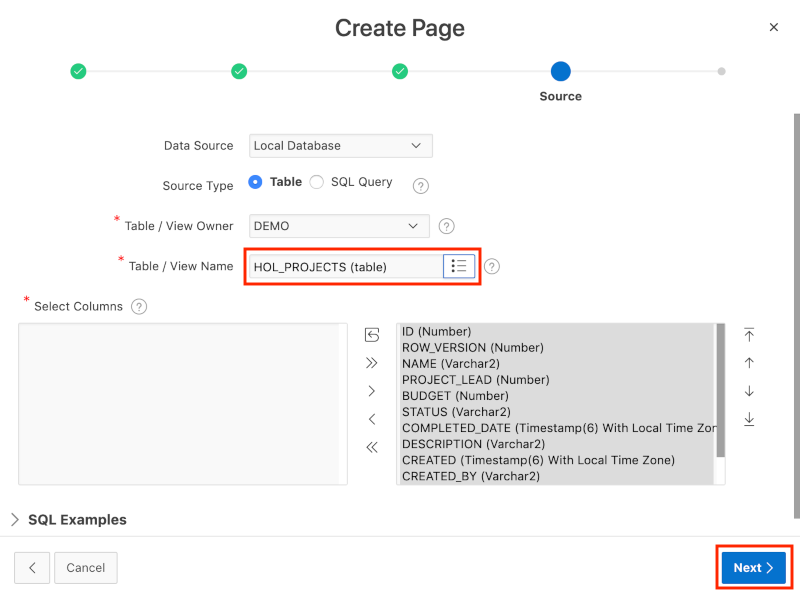

7. Set Display Column to **NAME**, set End Date Column to **COMPLETED_DATE**, then click **Create**.

   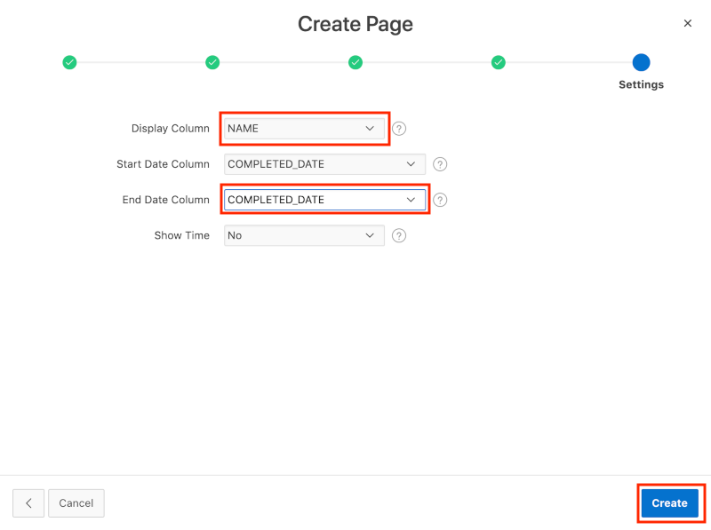

8. After the page is created, you will be redirected to the Page Designer for the new page. Click "Save and Run Page" to view the calendar at runtime.

   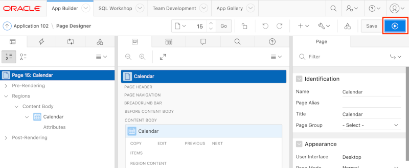

9. Use the arrow buttons to change the months until you see some entries in the calendar. Also, note the new navigation menu entry under **Projects**.

   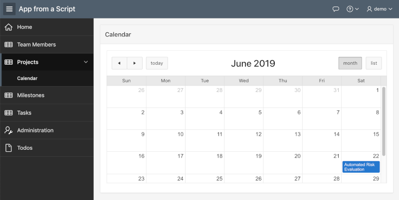

## Summary

You have completed the lab, well done! At this point you should have a basic understanding of how the Autonomous Transaction Processing service, along with APEX and SQL Developer Web can be used to develop data driven applications with very little code.
