# Lab 100: Obtain a Workspace

## Introduction

Oracle APEX will run within your Autonomous Database. As a result, you will need to create an Autonomous Transaction Processing service and then access Oracle APEX from within the Service Console. 

When you first go into Oracle APEX you will need to log into Oracle APEX Instance Administration to create a workspace. A workspace is a logical domain where you define Oracle APEX applications. It is associated with one or more database schemas (database users) which is used to store the database objects, such as tables, views, packages, and functions, and more. These database objects are generally what you base the Oracle APEX applications on.

***To log issues***, click here to go to the [github oracle](https://github.com/oracle/learning-library/issues/new) repository issue submission form.

## Lab 100 Objectives

- Log In to Cloud Account
- Create Autonomous Transaction Processing Service
- Create a, Oracle APEX Workspace
- Login to your new Workspace

## Steps

### **STEP 1:** Your Oracle Cloud Trial Account

You have already applied for and received your Oracle Cloud Trial Account.

### **STEP 2:** Log in to your Cloud Account

- Once you receive the **Get Started Now with Oracle Cloud** Email, make note of your **Username, Password and Cloud Account Name**.

- From any browser go to

  [https://cloud.oracle.com/en_US/sign-in](https://cloud.oracle.com/en_US/sign-in)

- Enter your **Cloud Account Name** in the input field and click the **Next** button.

  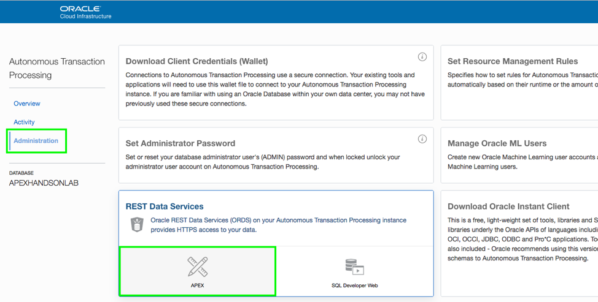

- Enter your **Username** and **Password** in the input fields and click **Sign In**.

  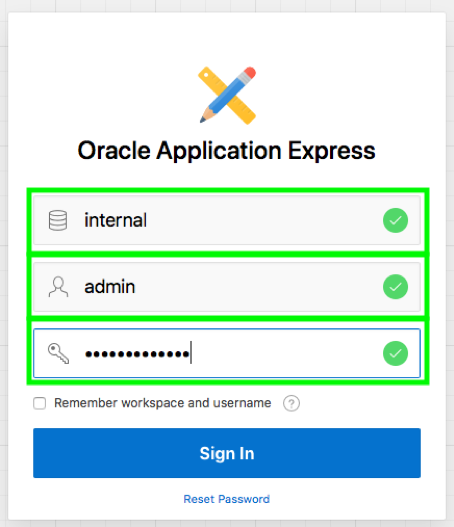

### **STEP 3:** Create an Autonomous Transaction Processing Service

- From the Cloud Dashboard, select the Hamburger Menu and select **Autonomous Transaction Processing**.

  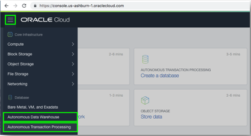

- Click **Create Autonomous Database**.

  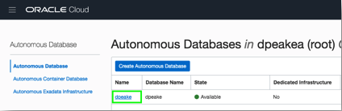

- You can accept all the defaults and click Create Autonomous Database.

  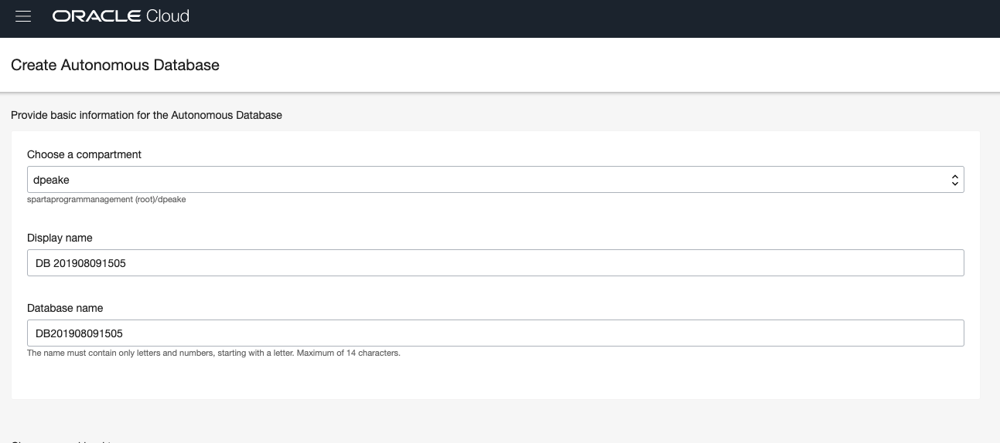
  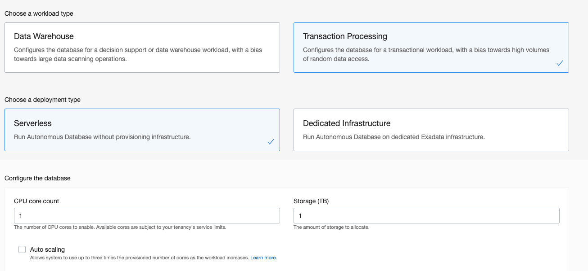
  

- Select your Autonomous Database in the list.

  

- Click **Service Console**.

  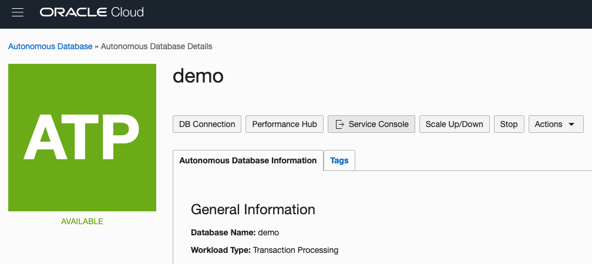

### **STEP 4:** Create an Oracle APEX Workspace

- Click **Development**, and then click **APEX**.

  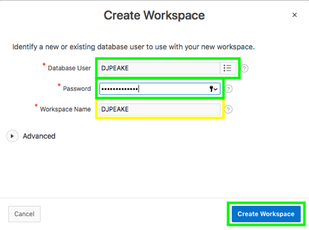

- Enter the credentials for Instance Administrator and click **Sign In**.
  -  Workspace = internal
  -  Username = admin
  -  Password = <APEX Password>

  
  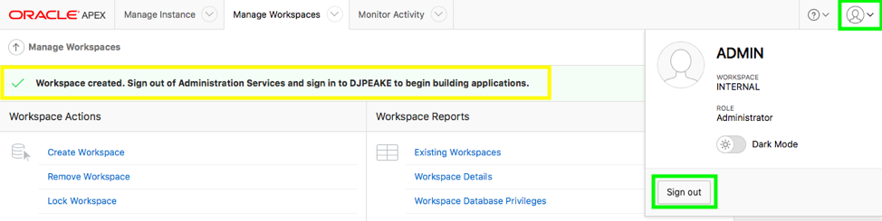

- Click **Create Workspace**.
  
  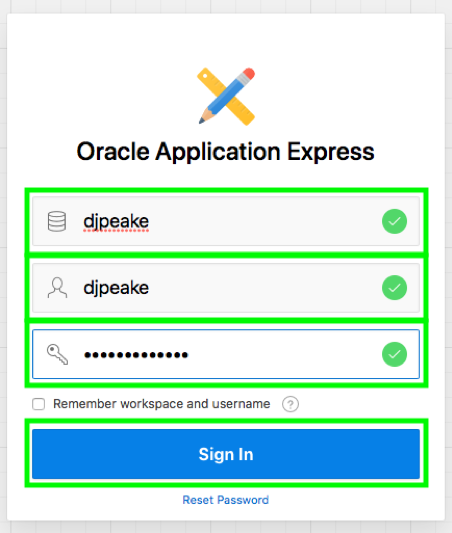

- Enter your database user details:
  -  Database User = <Your first initial || last name or similar>
  -  Password = <Your Password> {Note: The password must conform to Oracle Autonomous standards}
  -  Workspace Name = {Will default to Database User}
  
  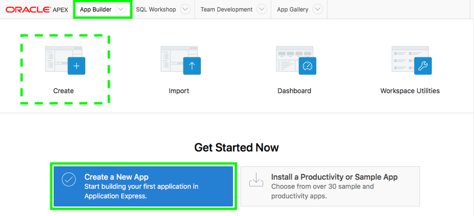

- Given you have created a workspace, you need to log out of Instance Administration and log into your new workspace. Click the Account Menu (Top right of the screen) and click **Sign Out**.
	
  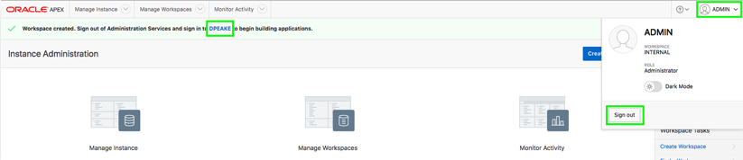

### **STEP 5:** Log In to Your New Workspace

- Enter your workspace details and click **Sign In**.

  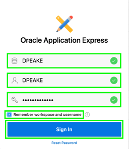

- Since this is your first time signing in to your Workspace, click **Set APEX Account Password**.

  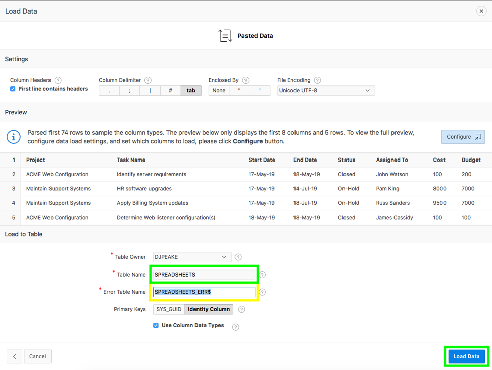

- For your user profile enter the following: and click **Apply Changes**.
  -  Email Address – enter your email address
  -  Enter New Password – enter your OCI Password
  -  Confirm Password – enter your OCI Password

  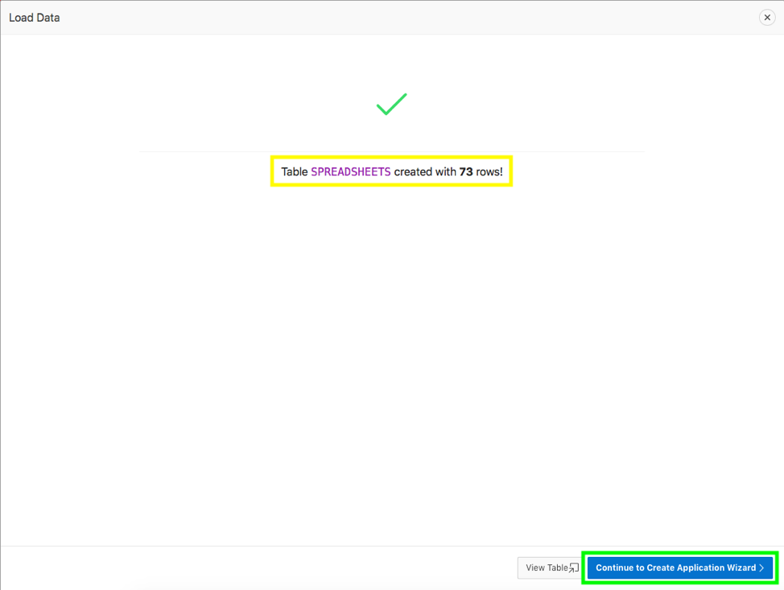

**This completes the Lab!**

**You are ready to proceed to [Lab 2](Lab2.md)**
