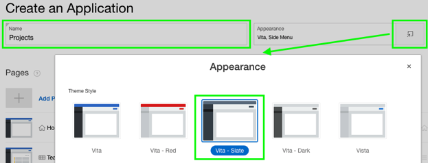
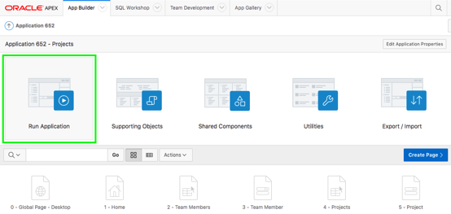
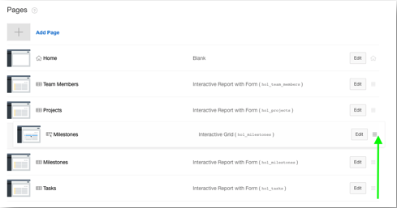
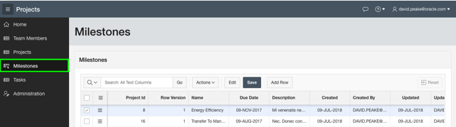

# Lab 400: Create and Modify APEX Application

## Introduction

put something here

***To log issues***, click here to go to the [github oracle](https://github.com/oracle/learning-library/issues/new) repository issue submission form.

## Lab 400 Objectives

- Create Interactive Report and Form
- Add Computation in Interactive Report
- Add a Chart to Your Interactive Report
- Save Interactive Report
- Set List of Values in Form
- Add a Calendar page

## Steps

### **STEP 1:** Create Interactive Report and Form

- Click **Create App from Script**
{Note: If you are back on SQL Scripts, and don’t see the “Create App from Script” button perform the following steps:1. Within the Results column, click “1” for the script you just ran. 2. Under View Results, click the magnifying glass. The results page shown above should now be displayed again}

  

- For Name, enter **Projects** and click Appearance. For Theme Style, select **Vita-Slate**.

  

- For Features, click **Check All**.

  

- Click **Create Application**.

  

- Your new application will be displayed in Page Designer. Click **Run Application**.

  

- Enter your credentials and review your new application.

  

- From the development environment, click **App Builder**, and then select **Create**.

  

- In the Create App Wizard, click **Load Blueprint** and for Projects, click **Load**. 

  

- Click **Add Page** and then click **Interactive Grid**.

  

- For Page Name, enter **Milestones**, for Table or View, select **HOL_MILESTONES** and click **Add Page**.

  

- Click and hold the mouse when hovering over the hamburger for the Milestones – Interactive Grid page. Move it up until the page is under Projects and release the mouse.

  

- For Milestones – Interactive Report with Form page, click **Edit** and then click **Delete**.

  

- Click **Create Application**. In Page Designer, click **Run Application**.

  

- In the runtime environment, click **Milestones**.

  

- In the Developer Toolbar, click **Edit Page 6**.

  

- In Page Designer, under Milestones, click **Columns** and click **PROJECT_ID**.

  

- In the Property Editor, update the following:
Identification: Type – select **Select List**
Heading: Heading – enter **Project**
List of Values: Type – select **SQL Query**
List of Values – SQL Query enter **select name d, id r from hol_projectsorder by 1**
Display Extra Values – click **No**
Display Null Value – click **No** 
Save and Run the App

  

- In the runtime environment, click **Actions**, select Columns
Uncheck Displayed for Id, Row Version, Created, Created By, Updated, and Updated By and click **Save**.

  

  

- In the runtime environment, click **Actions**, select **Report**, select **Save**.

  

**This completes the Lab!**

