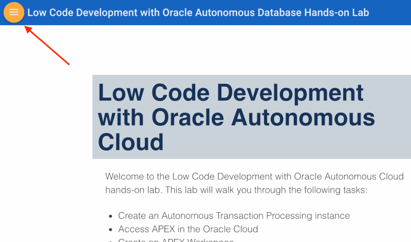
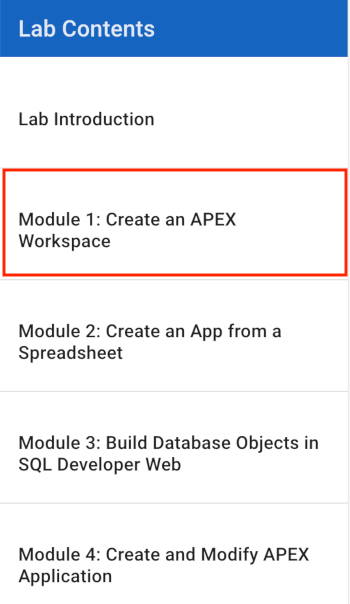

# Low Code Development with Oracle Autonomous Database

Welcome to the Low Code Development with Oracle Autonomous Database hands-on lab. This lab will walk you through the following tasks:

-  Create an Autonomous Transaction Processing instance
-  Access APEX in the Oracle Cloud
-  Create an APEX Workspace
-  Create an application from a file
-  Use Quick SQL to create database objects
-  Use SQL Developer Web to access database objects
-  Use SQL Developer Web to create data model
-  Create and modify an APEX application

## Parts

### **Part 1**: Acquire an Oracle Cloud trial account

1. If you already have an Oracle Cloud trial account, you may skip to the next part.

2. Please <a href="https://myservices.us.oraclecloud.com/mycloud/signup?language=en&sourceType=:ow:lp:cpo::RC_NAMK190523P00161:APEX_ATP_HOL&intcmp=:ow:lp:cpo::RC_NAMK190523P00161:APEX_ATP_HOL" target="_trial_">click this link to create your free account</a>. When you complete the registration process you'll receive an account with a $300 credit that will enable you to complete the lab for free. You can then use any remaining credit to continue to explore the Oracle Cloud.

3. Soon after requesting your trial you will receive the following email. Once you receive this email you can proceed to Part 2.

   

### **Part 2**: Navigate to Module 1

1. <a href="?page=1-create-an-apex-workspace.md">Click here</a> to navigate to Module 1. Alternatively, you can click the navigation menu icon in the upper-left corner of the browser window to see a list of modules in the lab.

	 

2. Click **Module 1: Create an APEX Workspace**.
  
   
