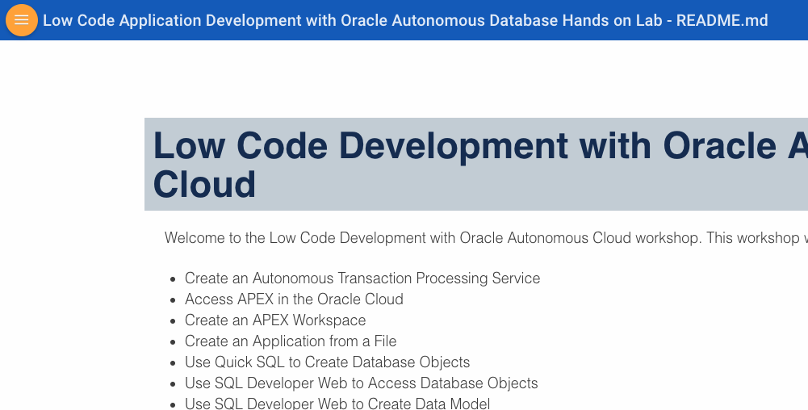
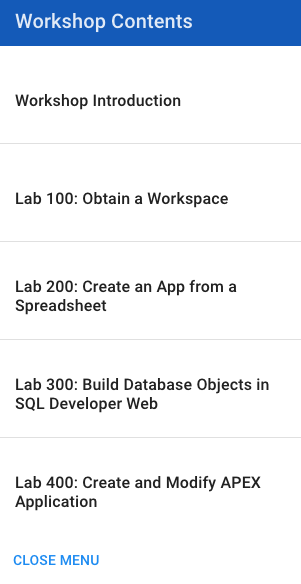

# Low Code Development with Oracle Autonomous Cloud

Welcome to the Low Code Development with Oracle Autonomous Cloud workshop. This workshop will walk you through the following tasks:

-  Create an Autonomous Transaction Processing instance
-  Access APEX in the Oracle Cloud
-  Create an APEX Workspace
-  Create an application from a file
-  Use Quick SQL to create database objects
-  Use SQL Developer Web to access database objects
-  Use SQL Developer Web to create data model
-  Create and modify an APEX application

### **Step 1**: Acquire an Oracle Cloud Trial

- Please click [this link](https://myservices.us.oraclecloud.com/mycloud/signup?language=en&sourceType=:ow:lp:cpo::RC_NAMK190523P00161:APEX_ATP_HOL&intcmp=:ow:lp:cpo::RC_NAMK190523P00161:APEX_ATP_HOL) and complete all the required steps to get your free Oracle Cloud trial account. When you complete the registration process, you'll receive a $300 credit that will enable you to complete the lab for free. Additionally, you'll have 1000s of hours left over to continue to explore the Oracle Cloud.

- Soon after requesting your trial you will receive the following email. Once you receive this email you can proceed to the next step.

  

### **Step 2**: Navigate to Lab 1

- Click the navigation menu icon in the upper left corner of the browser window to see a list of Lab Guides.

  

- Click the **Lab 1: Obtain a Workspace** option to navigate to the first lab.

  
